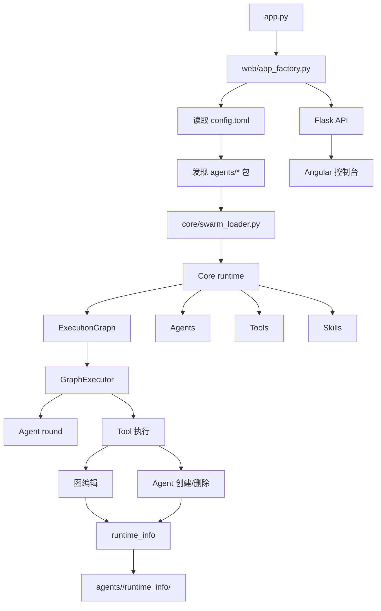

<div align="center">

<br />

# Angelus Lunae

### 一个支持动态改图、临时 agent 生成与运行时记录的多智能体编排运行时

[](https://python.org)
[](https://flask.palletsprojects.com)
[](https://angular.dev)
[](./docs/index.md)

[📖 文档索引](docs/index.md) · [🧭 API 结构](docs/api_structure.md) · [🧠 元数据约定](docs/metadata_reference.md) · [📦 业务包结构](docs/agent_structure.md)

<br />


<br />

</div>

---

## ✨ 为什么选择 Angelus？

> *“复杂的协作不该只是跑起来，还应该被看见、被编辑、被追踪。”*

Angelus 不是一个单纯的 agent 调度器，而是一个面向 swarm 场景的运行时骨架。  
它把“内容生成”和“控制编排”分开，把“静态图”和“运行时图”分开，把“agent 行为”和“graph 变更”分开。

它适合你在这些场景里继续往前走：

- 🧩 **可插拔 swarm 包** —— 每个 `agents/<swarm_name>/` 都是一套独立业务包
- ⚙️ **动态编排** —— 工具可以改图，agent 可以生成新的 agent，也可以删除它
- 🪞 **运行时可追踪** —— 变化会立刻写入 `agents/<swarm_name>/runtime_info/`
- 🌊 **实时执行流** —— 后端支持异步 run session 和 SSE 事件流
- 🧪 **前后端分离** —— Flask 后端 + Angular 控制台，便于持续迭代

---

## 🚀 五分钟上手

### 安装

```bash
python -m venv .lvenv
source .lvenv/bin/activate
pip install -r requirements.txt
```

### 配置

根配置文件是 `config.toml`，它只负责告诉 runtime 去哪里找 swarm 包：

```toml
[app]
swarm_root = "agents"
```

### 启动后端

```bash
python app.py
```

后端默认运行在 `http://127.0.0.1:5000`，所有接口统一挂在 `/api` 下。

### 打开控制台

在 `frontend/angelus/` 下启动 Angular 前端，并把 API base URL 指向 `/api`。

---

## 🎯 核心特性

### 🧠 Swarm 包机制

每个 swarm 包都是一个独立目录，包含：

- `swarm.toml`
- 一张执行图
- 一个或多个 agent 定义
- 一个或多个 skill
- 一个或多个 tool

### 🔄 动态图编排

- 支持运行时改图
- 运行时改图会回写到 `agents/<swarm_name>/graph.py`
- 初始图会自动备份为 `agents/<swarm_name>/graph_init.py`
- 支持添加边、删边、改 entry / exit
- 支持把临时 agent 插进当前执行图
- 支持把临时 agent 从图里删除

### 🪪 运行时记录

每一次 agent / tool / graph 的变化，都会写入：

- `agents/<swarm_name>/runtime_info/current.json`
- `agents/<swarm_name>/runtime_info/events.jsonl`

这让运行中的状态变化可回放、可审计、可调试。

### 🌐 Web API

后端提供：

- 健康检查
- swarm 列表和详情
- graph 快照
- 同步执行
- 异步 run session
- SSE 事件流
- 单 agent round 调用

### 🖥️ Angular 控制台

前端目前是一个原型控制台，但已经能：

- 查看 swarm 状态
- 触发 run
- 调用单个 agent
- 显示 API 状态与错误信息

---

## 🏗️ 架构概览



---

## 📦 项目结构

```text
angelus/
├── app.py                 # 后端入口
├── config.toml            # 根配置
├── core/                  # 运行时内核
├── modules/               # 基础设施模块
├── tools/                 # 默认 runtime tools
├── web/                   # Flask API
├── agents/                # 可加载 swarm 包
│   └── deepseek_demo/     # 当前演示包
├── frontend/              # Angular 控制台
├── docs/                  # 文档
└── outputs/               # 输出结果
```

---

## 🧪 Demo 包

当前主 demo 位于 `agents/deepseek_demo/`，它会展示一条完整的运行链：

1. `planner` 产出控制计划
2. `agent_manager` 创建临时 `auditor`
3. `graph_editor` 把临时 agent 插入活图
4. `auditor` 产出结论
5. `agent_manager` 删除临时 agent
6. `graph_editor` 移除临时节点
7. `publisher` 输出最终答案
8. `file_writer` 写入 `outputs/deepseek_demo_final.txt`

这个 demo 的重点是把：

- 内容流
- 控制流
- 图编辑
- 临时 agent 生命周期
- 运行时持久化

分开表达。

### 示例任务

如果你想测试当前 demo，可以直接输入下面这个任务：

> 请围绕“动态改图的多智能体运行时”写一段结构清晰的技术说明。  
> 要求：  
> 1. 先让 planner 生成控制计划；  
> 2. 临时创建一个 auditor agent 来复核内容；  
> 3. 在运行时把 auditor 插入工作图；  
> 4. 让 auditor 输出研究结论，而不是控制信息；  
> 5. 在结论产出后删除 auditor，并从图里移除对应节点；  
> 6. 最终输出一段可直接发布的说明文，并写入 `outputs/deepseek_demo_final.txt`。  

这个任务能完整体现：

- 图编辑
- agent 生成与删除
- 内容流与控制流分离
- runtime_info 落盘
- 最终结果输出

---

## 🛣️ 路线图

- [x] swarm 包加载
- [x] 运行时图执行
- [x] live run session
- [x] SSE 事件流
- [x] 图编辑工具
- [x] agent 创建 / 删除工具
- [x] runtime_info 落盘
- [ ] 更强的前端图谱渲染
- [ ] 更清晰的执行时间线
- [ ] 更严格的 skill contract 校验
- [ ] 持久化运行时 session
- [ ] 更丰富的分析型默认工具

---

## 📚 文档入口

- [文档索引](docs/index.md)
- [英文总览](docs/README.en.md)
- [API 结构](docs/api_structure.md)
- [后端参考](docs/backend_reference.md)
- [前端参考](docs/frontend_reference.md)
- [metadata 约定](docs/metadata_reference.md)
- [agent 目录结构](docs/agent_structure.md)

---

## 🤝 贡献说明

这个项目还在快速演进中。  
如果你要扩展它，建议优先沿着这几条线往前做：

1. 先补强图谱渲染
2. 再补强 runtime tracing
3. 再补强 skill contract
4. 最后再扩工具和持久化

---

## 许可

本项目采用 Apache License 2.0：

- [LICENSE](LICENSE)
- [中文参考译文](LICENSE.zh-CN.md)

> 中文版本仅供阅读理解，若与英文原文存在差异，以英文原文为准。
