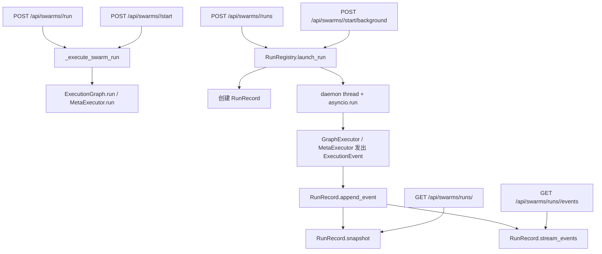

# 后端运行链路

这份文档只描述当前代码里和 `run` / `background run` / SSE 相关的真实实现，重点放在 `web/runs.py`、`web/routes/swarms.py` 和 `web/app_factory.py` 之间的配合。

## 1. 总体流程

当前实现里，执行链路分成两类：

- 同步运行：HTTP 请求直接等待图执行结束，再返回最终结果。
- 后台运行：HTTP 先返回一个 run 快照，真正执行放到守护线程里，之后通过 SSE 继续观察状态。

## 2. 路由入口

`web/routes/swarms.py` 里和运行相关的路由是这些：

- `POST /api/swarms/<swarm_name>/run`
- `POST /api/swarms/<swarm_name>/start`
- `POST /api/swarms/<swarm_name>/runs`
- `POST /api/swarms/<swarm_name>/start/background`
- `GET /api/swarms/runs/<run_id>`
- `GET /api/swarms/runs/<run_id>/events`

`web/app_factory.py` 里把 `swarms_bp` 注册到了 `/api/swarms` 前缀下，所以这些路径会以 `/api/swarms/...` 的形式暴露。

## 3. 同步运行

同步运行走的是 `web/routes/swarms.py` 里的 `_execute_swarm_run()`。

### 3.1 请求处理

同步分支会做这些事：

- 通过 `_get_swarm_or_404()` 找到 swarm
- 取出 `swarm.core.get_execution_graph()`
- 从请求体读取：
  - `input`
  - `rounds`
  - `meta_mode`
- 如果 `meta_mode` 为真，就调用 `MetaExecutor(max_iterations=5).run(...)`
- 否则直接调用 `graph.run(...)`

### 3.2 返回结果

同步接口返回：

- `success`
- `swarm`
- `rounds`
- `output`
- `trace`
- `metadata`

这类接口的特点是：

- 不创建 `RunRecord`
- 不走 SSE
- 不保留运行历史
- 请求会一直阻塞到执行完成或者抛错

## 4. 后台运行

后台运行走的是 `RunRegistry.launch_run()`。

### 4.1 创建 run

`launch_run()` 会：

- 生成一个新的 `run_id`，用的是 `uuid.uuid4().hex`
- 构造一个 `RunRecord`
- 先把 `RunRecord` 放进 `_runs` 字典
- 启动一个 `daemon=True` 的线程去执行任务

### 4.2 worker 执行

后台线程最终会进入 `RunRegistry._worker()`。

`_worker()` 里会包装一个异步函数 `_execute()`，然后通过 `asyncio.run(_execute())` 执行。它支持两种路径：

- `meta_mode=True` 时调用 `MetaExecutor.run(...)`
- 否则调用 `graph.run(...)`

关键点是，它们都会收到这些附加参数：

- `run_id=record.run_id`
- `swarm_name=swarm_name`
- `event_sink=record.append_event`

这意味着图执行过程中产生的每个 `ExecutionEvent`，都会被送进 `RunRecord.append_event()`。

### 4.3 异常处理

如果后台线程里抛出异常，并且 `record._done` 还没有被置位，`_worker()` 会补发一条 `run.failed` 事件，里面带上：

- `error`
- `state_snapshot`

这样即使线程级异常发生，`RunRecord` 里也尽量保留一个失败收尾状态。

## 5. RunRecord

`RunRecord` 是单次后台运行的内存态容器，定义在 [`web/runs.py`](/run/media/luna/数据和游戏/Codes/Python/angelus/web/runs.py)。

### 5.1 核心字段

`RunRecord` 里最重要的字段有：

- `run_id`
- `swarm_name`
- `status`
- `created_at`
- `started_at`
- `finished_at`
- `rounds`
- `current_node_id`
- `current_node_name`
- `current_node_type`
- `current_state`
- `final_state`
- `error`
- `events`

还有两个内部字段：

- `_done`
- `_condition`

### 5.2 状态更新规则

`append_event()` 会先把事件转成 JSON 兼容结构，再调用 `_apply_event()` 更新快照。

当前支持的事件类型和更新逻辑是：

- `run.started`
  - `status = "running"`
  - 填写 `started_at`
  - 如果事件数据里有 `state_snapshot`，就写入 `current_state`
- `run.completed`
  - `status = "completed"`
  - 填写 `finished_at`
  - 如果事件数据里有 `state_snapshot`，就写入 `final_state`
  - 同时把 `current_state` 同步成 `final_state`
  - `_done = True`
- `run.failed`
  - `status = "failed"`
  - 填写 `finished_at`
  - `error` 取事件里的 `error`
  - 如果事件数据里有 `state_snapshot`，就写入 `current_state`
  - `_done = True`
- 其它事件
  - 如果带 `node_id`，会更新 `current_node_id`
  - 会尽量更新 `current_node_name` 和 `current_node_type`
  - 如果有 `state_snapshot`，会更新 `current_state`
  - `node.failed` 会顺带更新 `error`

另外，`rounds` 字段会尝试从事件本体里的 `rounds` 覆盖。

### 5.3 `snapshot()` 返回什么

`RunRecord.snapshot()` 返回一个 JSON-ready 的运行快照，字段包括：

- `success`
- `run_id`
- `swarm`
- `status`
- `created_at`
- `started_at`
- `finished_at`
- `rounds`
- `current_node_id`
- `current_node_name`
- `current_node_type`
- `state`
- `final_state`
- `error`
- `event_count`
- `events_url`
- `status_url`

其中：

- `state` 对应当前运行态
- `final_state` 只在完成后才会真正有意义
- `event_count` 是当前已经缓存的事件数量
- `events_url` 和 `status_url` 是给前端用的链接

## 6. RunRegistry

`RunRegistry` 是线程安全的后台运行注册表。

### 6.1 主要方法

- `launch_run(...)`
  - 创建 `RunRecord`
  - 起后台线程
  - 返回 `RunRecord`
- `get_run(run_id)`
  - 根据 `run_id` 取单条记录
- `list_runs(swarm_name=None)`
  - 返回全部记录，或按 swarm 过滤
- `snapshot(run_id)`
  - 返回单条运行快照
- `active_run_count(swarm_name=None)`
  - 返回仍未 `_done` 的运行数
- `active_run_ids(swarm_name=None)`
  - 返回仍未 `_done` 的 run id 列表

### 6.2 当前实现特点

- 运行记录只存在内存里
- 服务重启后，历史 run 会全部丢失
- 目前没有持久化层
- 目前也没有清理旧 run 的自动回收逻辑

## 7. SSE 事件流

`GET /api/swarms/runs/<run_id>/events` 由 `stream_run()` 提供，响应类型是 `text/event-stream`。

### 7.1 事件流起始行为

`stream_run_events(record)` 会先输出一条：

- `event: run.snapshot`

然后再输出当前 `record.snapshot()` 的 JSON 数据。

之后才会继续把 `record.events` 里的事件逐条流出去。

### 7.2 单条 SSE 帧格式

`RunRecord.stream_events()` 会把每个事件写成：

- `event: <event_type>`
- `data: <json>`

事件名来自 `_event_name()`，它会把 `event_type` 里的空格替换成点号。

### 7.3 keepalive

如果一段时间没有新事件，流会发送：

- `: keepalive`

这是为了避免长连接在中间被代理或浏览器静默断开。

### 7.4 当前会出现的事件类型

从 `core/executor.py` 和 `web/runs.py` 的实现看，后台运行里会看到这些事件：

- `run.started`
- `node.started`
- `node.completed`
- `node.failed`
- `branch.started`
- `branch.completed`
- `branch.failed`
- `run.completed`
- `run.failed`

## 8. 路径不一致和已知偏差

这里曾经有一个路径偏差，现在已经修正为和真实路由一致：

| 项目 | 现在生成的值 | 真实路由 |
|---|---|---|
| `status_url` | `/api/swarms/runs/{run_id}` | `/api/swarms/runs/{run_id}` |
| `events_url` | `/api/swarms/runs/{run_id}/events` | `/api/swarms/runs/{run_id}/events` |

也就是说：

- 后端快照里写的 URL 现在已经和实际暴露地址一致
- 前端仍保留了对旧快照格式的防御性回退，避免读取到历史缓存值时出错
- 新的快照和 SSE 订阅都直接指向 `/api/swarms/runs/...`

另外还有一个小细节：

- `RunRecord.stream_events()` 支持 `after` 参数
- 但 `stream_run()` 目前没有从 query string 里接这个参数
- 所以现在的路由实际总是从头开始流

## 9. 结论

当前这套运行实现已经把“同步执行”和“后台执行 + SSE 追踪”分开了：

- 同步接口适合直接拿最终结果
- 后台接口适合页面实时观察
- `RunRecord` 负责把事件压成可查询快照
- `RunRegistry` 负责管理内存中的运行会话

但它还是一个纯内存实现，且 `events_url` / `status_url` 目前和真实路由存在路径偏差，这一点需要在对接层特别注意。
