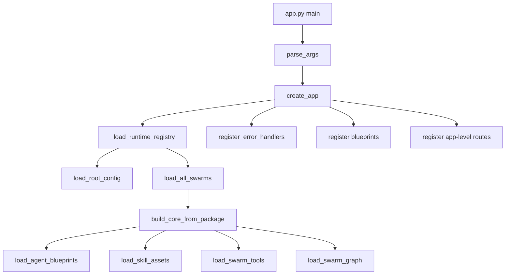
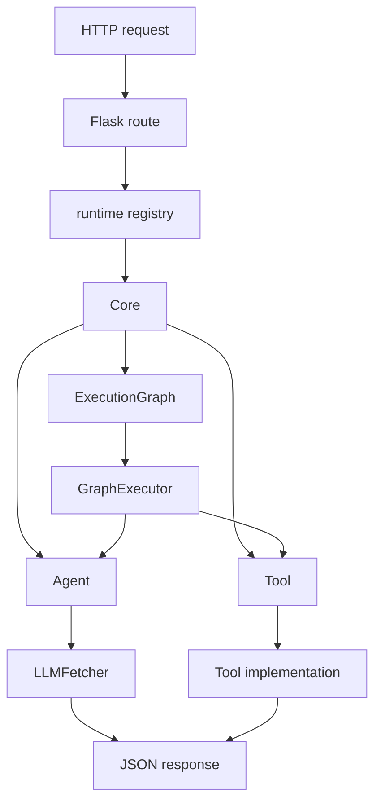
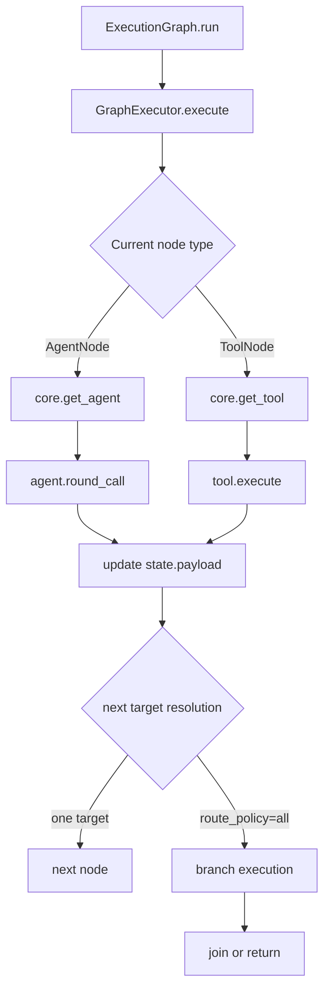

# 后端程序全量参考

本文档按代码实现逐文件梳理后端程序的每一个公开类、函数和主要导出点，说明它们的输入、内部行为和输出，并用 Mermaid 画出整体流程。

## 1. 总体流程图

### 1.1 启动流程

### 1.2 请求调度流程

### 1.3 图执行流程

## 2. 入口文件

### 2.1 `app.py`

#### `parse_args() -> argparse.Namespace`
- 输入：命令行参数 `--config`、`--host`、`--port`、`--debug`
- 内部行为：构造 `ArgumentParser`，定义后端启动参数
- 输出：解析后的参数对象

#### `main() -> None`
- 输入：无，读取 `parse_args()` 的结果
- 内部行为：
  - 调用 `create_app(args.config)`
  - 用 Flask 内置开发服务器启动应用
- 输出：无；副作用是启动 HTTP 服务

## 3. Web 层

### 3.1 `web/__init__.py`
- 对外导出 `create_app`
- 作用：把 Flask 应用工厂作为 web 包入口

### 3.2 `web/app_factory.py`

#### `_load_runtime_registry(config_path: Path) -> Dict[str, object]`
- 输入：顶层 `config.toml` 路径
- 内部行为：
  - `load_root_config`
  - `load_all_swarms`
  - 将每个 swarm 按 `swarm_name` 建索引
- 输出：运行时注册表字典

#### `create_app(config_path: str | Path = "config.toml") -> Flask`
- 输入：顶层配置文件路径
- 内部行为：
  - 创建 Flask app
  - 尝试加载 runtime registry
  - 捕获 `SwarmLoaderError`
  - 注册错误处理器
  - 注册 `health_bp`、`swarms_bp`
  - 注册 app-level 路由：`/`、`/api`、`/api/swarms`、`/api/swarms/<name>`、`/api/swarms/<name>/run`、`/api/swarms/<name>/agents/<agent_id>/round`
- 输出：配置完成的 Flask app

#### App-level `index()`
- 输入：无
- 内部行为：从 runtime registry 汇总 `swarm_count` 和 `load_error`
- 输出：JSON 首页

#### App-level `api_index()`
- 输入：无
- 内部行为：返回与 `/` 类似的信息，并额外包含 `api_root`
- 输出：JSON API 首页

#### App-level `api_swarms()`
- 输入：无
- 内部行为：
  - 读取 runtime registry
  - 遍历已加载 swarm
  - 对每个 swarm 做图校验并组装摘要
- 输出：`{"success": true, "swarms": [...]}` 的 JSON

#### App-level `api_swarm_detail(swarm_name: str)`
- 输入：`swarm_name`
- 内部行为：
  - 在 registry 中查找对应 swarm
  - 找不到返回 404
  - 找到后返回完整详情和图校验状态
- 输出：单 swarm JSON 详情

#### App-level `api_run_swarm(swarm_name: str)`
- 输入：
  - 路径参数 `swarm_name`
  - 请求体 `input`、`rounds`
- 内部行为：
  - 查找 swarm
  - 取出 `ExecutionGraph`
  - 调用 `graph.run(swarm.core, payload, rounds=rounds)`
  - 使用 `to_jsonable` 规整输出
- 输出：执行结果 JSON

#### App-level `api_run_agent_round(swarm_name: str, agent_id: str)`
- 输入：
  - 路径参数 `swarm_name`、`agent_id`
  - 请求体 `message`、`rounds`、`additional_prompt`
- 内部行为：
  - 查找 swarm 和 agent
  - 校验 message 非空
  - 调用 `agent.round_call(...)`
  - 使用 `to_jsonable` 规整结果和上下文
- 输出：agent round JSON

### 3.3 `web/errors.py`

#### `ApiError(RuntimeError)`
- 输入：错误消息
- 内部行为：携带 HTTP-friendly 的 `status_code`
- 输出：可转成 JSON 响应的业务异常

#### `ApiError.to_response() -> Tuple[Any, int]`
- 输入：无
- 内部行为：把错误字符串包装成 `{"success": false, "error": ...}`
- 输出：`(jsonify_payload, status_code)`

#### `NotFoundError(ApiError)`
- 作用：把错误映射为 404

#### `ConflictError(ApiError)`
- 作用：把错误映射为 409

#### `register_error_handlers(app) -> None`
- 输入：Flask app
- 内部行为：
  - 注册 `ApiError`
  - 注册 `SwarmLoaderError`
  - 注册 `KeyError`
  - 注册 `ValueError`
  - 注册兜底 `Exception`
- 输出：无；副作用是挂载统一 JSON 错误处理

### 3.4 `web/routes/health.py`

#### `health()`
- 输入：无
- 内部行为：直接返回存活状态
- 输出：`{"success": true, "status": "ok"}`

#### `ready()`
- 输入：无
- 内部行为：
  - 先看 `load_error`
  - 再看是否有 swarm
  - 再逐个检查图有效性
- 输出：
  - 成功：`{"success": true, "ready": true, "swarm_count": ...}`
  - 失败：503，并返回失败原因

### 3.5 `web/routes/swarms.py`

#### `_get_runtime_registry()`
- 输入：无
- 内部行为：从 `app.extensions["angelus_runtime"]` 取运行时注册表
- 输出：注册表字典；没有则抛 `ApiError`

#### `_get_swarm_or_404(swarm_name: str)`
- 输入：`swarm_name`
- 内部行为：从 registry 中查 swarm
- 输出：swarm 对象；找不到则抛 `NotFoundError`

#### `list_swarms()`
- 输入：无
- 内部行为：遍历所有 swarm，组装摘要和图校验信息
- 输出：swarm 列表 JSON

#### `get_swarm(swarm_name: str)`
- 输入：`swarm_name`
- 内部行为：返回单个 swarm 的详情和校验结果
- 输出：swarm 详情 JSON

#### `run_swarm(swarm_name: str)`
- 输入：
  - 路径参数 `swarm_name`
  - 请求体 `input`、`rounds`
- 内部行为：
  - 取 `ExecutionGraph`
  - 调 `await graph.run(...)`
  - 使用 `to_jsonable` 规整 `payload`、`trace`、`metadata`
- 输出：swarm 执行结果 JSON

#### `run_agent_round(swarm_name: str, agent_id: str)`
- 输入：
  - 路径参数 `swarm_name`、`agent_id`
  - 请求体 `message`、`rounds`、`additional_prompt`
- 内部行为：
  - 取 agent
  - 校验消息非空
  - 调 `await agent.round_call(...)`
  - 使用 `to_jsonable` 规整返回值与上下文
- 输出：agent round 结果 JSON

## 4. Core 运行时

### 4.1 `core/config.py`

#### `AgentConfig`
- 输入字段：
  - `api_url`
  - `api_key`
  - `model`
  - `provider`
- 作用：
  - 为默认 agent backend 提供共享配置

### 4.2 `core/results.py`

#### `AgentContextSnapshot`
- 输入字段：
  - `messages`
  - `metadata`
- 作用：
  - 表示 agent 隔离上下文的安全快照

#### `AgentRoundResult`
- 输入字段：
  - `rounds`
  - `user_message`
  - `assistant_message`
  - `raw_response`
  - `additional_prompt`
- 作用：
  - 表示一次 agent round 的结果

#### `ExecutionState`
- 输入字段：
  - `payload`
  - `rounds`
  - `metadata`
  - `trace`
  - `branch_results`
- 方法：`clone()`
  - 内部行为：深拷贝 payload / metadata / trace / branch_results
  - 输出：可脱离父状态的副本

#### `GraphValidationResult`
- 输入字段：
  - `is_valid`
  - `errors`
  - `warnings`
- 作用：
  - 记录图校验结果

### 4.3 `core/protocols.py`

#### `AgentLike(Protocol)`
- 需要成员：
  - `agent_id`
  - `character_prompt`
- 需要方法：
  - `round_call(...)`
  - `get_context_snapshot()`
  - `reset_context()`
- 作用：
  - 统一 `Core` 可管理的 agent 形状

### 4.4 `core/agent.py`

#### `AgentContext`
- 输入字段：
  - `messages`
  - `metadata`
- 作用：
  - 每个 agent 的本地上下文容器

#### `Agent.__init__(agent_id, llm_handler, character_prompt, name=None)`
- 输入：
  - `agent_id`
  - `llm_handler`
  - `character_prompt`
  - `name`
- 内部行为：
  - 保存基础配置
  - 初始化独立上下文
- 输出：Agent 实例

#### `append_context(role, content)`
- 输入：`role`、`content`
- 内部行为：向 agent 本地上下文追加消息
- 输出：无

#### `get_context_snapshot()`
- 输入：无
- 内部行为：返回消息和 metadata 的浅安全复制
- 输出：`AgentContextSnapshot`

#### `reset_context()`
- 输入：无
- 内部行为：清空消息和 metadata
- 输出：无

#### `_build_system_prompt(additional_prompt=None)`
- 输入：`additional_prompt`
- 内部行为：把角色提示词和额外提示词拼接为系统 prompt
- 输出：字符串

#### `_extract_assistant_message(response)`
- 输入：LLM SDK 原始响应
- 内部行为：兼容对象/字典格式，从第一条 choice 里提取 assistant content
- 输出：assistant 文本或 `None`

#### `round_call(rounds, user_message, additional_prompt=None)`
- 输入：
  - `rounds`
  - `user_message`
  - `additional_prompt`
- 内部行为：
  - 追加用户消息到上下文
  - 构造 system prompt
  - 把历史消息转成 `LLMContext`
  - 调用 `llm_handler.fetch(...)`
  - 尝试提取 assistant 内容
  - 更新 metadata: `last_round`、`turns`
- 输出：`AgentRoundResult`

### 4.5 `core/core.py`

#### `Core.__init__(agent_name, agent_config)`
- 输入：
  - `agent_name`
  - `agent_config`
- 内部行为：
  - 初始化 agent/tool/skill 注册表
  - 初始化 execution graph 指针
- 输出：Core 实例

#### `init()`
- 输入：无
- 内部行为：如果已经挂载 graph，则进行完整性校验
- 输出：无

#### `create_agent(agent_id, character_prompt, name=None, llm_handler=None)`
- 输入：
  - `agent_id`
  - `character_prompt`
  - `name`
  - `llm_handler`
- 内部行为：
  - 若未传入 `llm_handler`，用 `agent_config` 构建默认 `LLMFetcher`
  - 创建 `Agent`
  - 注册到 Core
- 输出：新建的 `Agent`

#### `add_agent(agent)`
- 输入：实现 `AgentLike` 的 agent
- 内部行为：按 `agent_id` 去重注册
- 输出：无

#### `remove_agent(agent_id)`
- 输入：`agent_id`
- 内部行为：
  - 从 registry 删除 agent
  - 若存在则调用 `reset_context()`
- 输出：无

#### `destroy_agent(agent_id)`
- 输入：`agent_id`
- 内部行为：别名调用 `remove_agent`
- 输出：无

#### `get_agent(agent_id)`
- 输入：`agent_id`
- 内部行为：按 id 取 agent；不存在抛 KeyError
- 输出：agent 对象

#### `list_agents()`
- 输入：无
- 内部行为：返回注册 agent 的列表
- 输出：`List[AgentLike]`

#### `register_tool(tool)`
- 输入：ToolDefinition 实例
- 内部行为：
  - 调用 `tool.validate()`
  - 按 `tool_name` 去重注册
- 输出：无

#### `register_skill(skill)`
- 输入：SkillAsset
- 内部行为：按 skill 名称注册
- 输出：无

#### `get_skill(skill_name)`
- 输入：`skill_name`
- 内部行为：按名称检索 skill；失败抛 KeyError
- 输出：SkillAsset

#### `list_skills()`
- 输入：无
- 内部行为：返回注册 skill 列表
- 输出：`List[SkillAsset]`

#### `remove_tool(tool_name)`
- 输入：`tool_name`
- 内部行为：从工具注册表删除
- 输出：无

#### `get_tool(tool_name)`
- 输入：`tool_name`
- 内部行为：按名称检索工具；失败抛 KeyError
- 输出：ToolDefinition

#### `set_execution_graph(graph)`
- 输入：ExecutionGraph
- 内部行为：保存当前图
- 输出：无

#### `get_execution_graph()`
- 输入：无
- 内部行为：返回当前图引用
- 输出：ExecutionGraph 或 `None`

#### `check_execution_graph_available()`
- 输入：无
- 内部行为：
  - 图不存在时返回 invalid
  - 图存在时调用 `graph.validate(self)`
- 输出：`GraphValidationResult`

#### `check_execution_graph_complete()`
- 输入：无
- 内部行为：与 `check_execution_graph_available()` 类似，用于完整性检查
- 输出：`GraphValidationResult`

### 4.6 `core/policy.py`

#### `Node`
- 输入字段：
  - `node_id`
  - `node_name`
  - `next_node_ids`
  - `metadata`
- 作用：
  - 任何 graph 节点的基础定义

#### `Edge`
- 输入字段：
  - `from_node_id`
  - `to_node_id`
  - `label`
  - `condition`
  - `priority`
- 作用：
  - 表示两节点之间的有向关系与分支标签

#### `AgentNode(Node)`
- 输入字段：
  - `agent_id`
  - `additional_prompt`
- 作用：
  - 将执行委派给受管 agent

#### `ToolNode(Node)`
- 输入字段：
  - `tool_name`
  - `input_mapping`
- 作用：
  - 将执行委派给工具

#### `ExecutionStep`
- 输入字段：
  - `node_id`
  - `node_name`
  - `node_type`
  - `input_payload`
  - `output_payload`
  - `status`
  - `error`
  - `branch`
- 作用：
  - 图执行 trace 的单步记录

#### `ExecutionGraph.__init__(graph_name)`
- 输入：图名称
- 内部行为：初始化节点表、边表、入口和出口
- 输出：ExecutionGraph 实例

#### `add_node(node)`
- 输入：Node / AgentNode / ToolNode
- 内部行为：按 `node_id` 去重添加
- 输出：无

#### `add_edge(from_node_id, to_node_id, label=None, condition=None, priority=0)`
- 输入：起点、终点和可选分支信息
- 内部行为：
  - 校验节点存在
  - 同步更新 `next_node_ids`
  - 追加 `Edge`
- 输出：无

#### `replace_next(from_node_id, to_node_ids)`
- 输入：起点和新的后继列表
- 内部行为：
  - 校验节点存在
  - 替换 `next_node_ids`
  - 重建对应边
- 输出：无

#### `remove_edge(from_node_id, to_node_id)`
- 输入：边两端节点 id
- 内部行为：从 `next_node_ids` 和 `edges` 同时删除
- 输出：无

#### `remove_node(node_id)`
- 输入：节点 id
- 内部行为：
  - 删除节点
  - 清理所有引用它的边和 next 节点
  - 必要时清空 entry/exit
- 输出：无

#### `set_entry(node_id)`
- 输入：节点 id
- 内部行为：校验存在后设置入口
- 输出：无

#### `set_exit(node_id)`
- 输入：节点 id
- 内部行为：校验存在后设置出口
- 输出：无

#### `_ensure_node_exists(node_id)`
- 输入：节点 id
- 内部行为：不存在则抛 KeyError
- 输出：无

#### `validate(core=None)`
- 输入：可选 Core
- 内部行为：
  - 校验节点、边、入口、出口
  - 校验 AgentNode / ToolNode 引用是否存在
  - 记录 errors 与 warnings
- 输出：`GraphValidationResult`

#### `is_available(core=None)`
- 输入：可选 Core
- 内部行为：返回 `validate(...).is_valid`
- 输出：布尔值

#### `is_complete(core=None)`
- 输入：可选 Core
- 内部行为：要求 valid 且无 warnings
- 输出：布尔值

#### `run(core, initial_payload, rounds=0)`
- 输入：
  - Core
  - 初始 payload
  - 初始轮次
- 内部行为：创建 `GraphExecutor` 并执行图
- 输出：`ExecutionState`

#### `clone()`
- 输入：无
- 内部行为：克隆节点、边、入口、出口
- 输出：新的 ExecutionGraph

#### `outgoing_edges(node_id)`
- 输入：节点 id
- 内部行为：取出该节点的边并按 priority 排序
- 输出：`List[Edge]`

#### `_clone_node(node)`
- 输入：Node 实例
- 内部行为：复制通用字段和节点特有字段
- 输出：同类型节点副本

#### `_node_specific_kwargs(node)`
- 输入：Node 实例
- 内部行为：为 AgentNode / ToolNode 提供额外构造参数
- 输出：字典

#### `_edge_exists(from_node_id, to_node_id, label=None, condition=None)`
- 输入：边信息
- 内部行为：检查是否已有相同边
- 输出：布尔值

### 4.7 `core/executor.py`

#### `GraphExecutor.execute(graph, core, initial_payload, rounds=0)`
- 输入：
  - ExecutionGraph
  - Core
  - 初始 payload
  - 初始轮次
- 内部行为：
  - 先做图校验
  - 从 entry node 启动 `_execute_from_node`
- 输出：`ExecutionState`

#### `_execute_from_node(graph, core, state, current_node_id)`
- 输入：
  - graph
  - core
  - 当前状态
  - 当前节点 id
- 内部行为：
  - 识别当前节点类型
  - `AgentNode` -> 调 `agent.round_call`
  - `ToolNode` -> 调 `tool.execute`
  - 记录 trace
  - 根据 `next_node_override`、`next_node_ids`、`branch`、`branches`、edges 决定下一步
  - 支持 `route_policy == "all"` 的分支执行与汇合
- 输出：更新后的 `ExecutionState`

#### `_build_tool_arguments(node, payload)`
- 输入：
  - ToolNode
  - 当前 payload
- 内部行为：
  - 将 payload 转成字典或 `{"input": payload}`
  - 覆盖节点的 `input_mapping`
- 输出：工具参数字典

#### `_extract_next_node_id(payload)`
- 输入：任意 payload
- 内部行为：如果 payload 是字典且包含 `next_node_id`，则提取并转 int
- 输出：下一节点 id 或 `None`

#### `_resolve_next_targets(graph, node, payload, next_node_override)`
- 输入：
  - graph
  - 当前 node
  - 当前 payload
  - 手工 override 的下一节点
- 内部行为：
  - 优先使用 override
  - 其次检查 `next_node_ids`
  - 再看 `branch` / `branches`
  - 最后使用 outgoing edges 或节点自带 next_node_ids
- 输出：下一步节点 id 列表

#### `_match_branch_targets(graph, node_id, branch_value)`
- 输入：
  - 图
  - 当前节点 id
  - 分支标签
- 内部行为：
  - 数字字符串直接转节点 id
  - 否则匹配 edge 的 label / condition
- 输出：匹配到的目标节点列表

#### `_format_agent_input(payload, node)`
- 输入：
  - 当前 payload
  - AgentNode
- 内部行为：
  - dict 且只有 `input` 时返回其值
  - 否则转字符串
  - 如果是非 dict 且有 additional_prompt，会拼接提示词
- 输出：传给 agent 的字符串

## 5. 装载与规范层

### 5.1 `core/swarm_spec.py`

#### `SwarmLoaderError(ValueError)`
- 输入：错误消息
- 作用：表示 swarm 包解析或加载失败

#### `SwarmAppConfig`
- 输入字段：
  - `swarm_root`
- 作用：根目录配置

#### `AgentBlueprint`
- 输入字段：
  - `agent_id`
  - `character_prompt`
  - `name`
  - `backend_name`
  - `api_url`
  - `api_key`
  - `model`
  - `provider`
  - `skill_name`
  - `prompt_file`
  - `prompt_text`
- 作用：
  - 作为 agent 的静态蓝图

#### `SwarmManifest`
- 输入字段：
  - `swarm_name`
  - `graph_file`
  - `agent_files`
  - `tool_files`
  - `skill_files`
  - `default_backend`
  - `default_llm`
  - `llm_backends`
- 作用：
  - swarm 包索引和约束

#### `load_root_config(path)`
- 输入：根 `config.toml`
- 内部行为：
  - 读取 `[app]` 或根表
  - 解析 `swarm_root`
- 输出：`SwarmAppConfig`

#### `discover_swarm_packages(root)`
- 输入：swarm 根目录
- 内部行为：遍历子目录，找包含 `*.toml` 的目录
- 输出：swarm 包路径列表

#### `load_swarm_manifest(package_path)`
- 输入：一个 swarm 包目录
- 内部行为：
  - 检查只允许一个 TOML
  - 解析 `[swarm]`、`[llm]`
  - 校验 graph_file、agent_files
- 输出：`(manifest_path, SwarmManifest)`

#### `load_agent_blueprints(package_path, manifest)`
- 输入：包路径与 manifest
- 内部行为：
  - 逐个导入 agent 文件
  - 读取 `AGENT` / `AGENT_SPEC` / `AGENTS`
  - 转成 `AgentBlueprint`
- 输出：蓝图列表

#### `_load_module_from_path(path)`
- 输入：Python 文件路径
- 内部行为：基于文件路径动态导入模块
- 输出：Python 模块对象

#### `_extract_agent_specs(module)`
- 输入：Python 模块
- 内部行为：从 `AGENTS` / `AGENT_SPEC` / `AGENT` 提取原始 dict
- 输出：字典列表

#### `_coerce_agent_blueprint(raw, source)`
- 输入：
  - 原始 dict
  - 源文件路径
- 内部行为：校验 `agent_id`，并规范化字段
- 输出：`AgentBlueprint`

#### `_parse_llm_backend(raw, fallback_name="default")`
- 输入：TOML 表
- 内部行为：
  - 校验 provider、model、api_key
  - 构造 `LLMBackendConfig`
- 输出：`LLMBackendConfig` 或 `None`

#### `_parse_llm_backend_list(raw)`
- 输入：`[[llm.backends]]`
- 内部行为：逐项调用 `_parse_llm_backend`
- 输出：后端配置列表

#### `_normalize_path_list(raw, field_name)`
- 输入：TOML 数组
- 内部行为：过滤空字符串并转成字符串列表
- 输出：路径列表

#### `load_skill_assets(package_path, manifest)`
- 输入：包路径和 manifest
- 内部行为：逐个加载 `skill_files`
- 输出：`SkillAsset` 列表

### 5.2 `core/skills.py`

#### `SkillContract`
- 输入字段：
  - `version`
  - `capability`
  - `description`
  - `input_schema`
  - `output_schema`
  - `requires_tools`
  - `requires_skills`
  - `preconditions`
  - `postconditions`
  - `failure_policy`
  - `parallelizable`
- 作用：
  - skill 的结构化能力契约

#### `SkillAsset`
- 输入字段：
  - `name`
  - `path`
  - `content`
  - `contract`
  - `metadata`
- 作用：
  - skill 的可加载提示词资产

#### `load_skill_asset(path)`
- 输入：skill 文件路径
- 内部行为：
  - 支持 `.md` / `.txt` / `.prompt`
  - 支持 `.toml`
  - 读取正文与 contract sidecar
- 输出：`SkillAsset`

#### `_normalize_skill_name(raw_name)`
- 输入：原始文件名
- 内部行为：把 `.` 和 `-` 替换成 `_`
- 输出：规范化 skill 名称

#### `_load_skill_contract_sidecar(path)`
- 输入：skill 文件路径
- 内部行为：查找同名 `.toml` sidecar
- 输出：`SkillContract` 或 `None`

#### `_parse_contract_section(skill_section)`
- 输入：`[skill]` TOML table
- 内部行为：转成 `SkillContract`
- 输出：`SkillContract`

#### `_contract_metadata(contract)`
- 输入：`SkillContract`
- 内部行为：将 contract 扁平化成 metadata
- 输出：metadata 字典

#### `_as_mapping(raw)`
- 输入：任意对象
- 内部行为：校验是否为 dict
- 输出：字典

#### `_as_string_list(raw)`
- 输入：任意对象
- 内部行为：校验是否为 list 并转字符串列表
- 输出：字符串列表

## 6. LLM 基础设施

### 6.1 `modules/llm_fetcher/__init__.py`
- 对外导出：
  - `LLMFetcher`
  - `LLMContext`
  - `LLMBackendConfig`
  - `LLMError`
  - `LLMTimeoutError`
  - `LLMBackendError`

### 6.2 `modules/llm_fetcher/llm_fetcher.py`

#### `LLMContext`
- 输入字段：
  - `role`
  - `content`
- 作用：
  - 表示历史聊天消息

#### `LLMBackendConfig`
- 输入字段：
  - `name`
  - `provider`
  - `model`
  - `api_key`
  - `api_url`
  - `timeout`
  - `max_retries`
  - `extra`
- 作用：
  - 表示一个可路由的 LLM 后端

#### `LLMError(RuntimeError)`
- 作用：LLM 后端通用错误

#### `LLMTimeoutError(LLMError, TimeoutError)`
- 作用：超时错误

#### `LLMBackendError(LLMError)`
- 作用：所有候选后端都失败时抛出

#### `LLMFetcher.__init__(...)`
- 输入：
  - 兼容旧式单后端参数，或
  - `backends` / `default_backend`
- 内部行为：
  - 注册后端
  - 为 OpenAI provider 预创建客户端
  - 选出默认后端
- 输出：LLMFetcher 实例

#### `_register_backend(backend)`
- 输入：单个后端配置
- 内部行为：记录配置、顺序，并初始化 OpenAI client
- 输出：无

#### `_resolve_backends(backend_name, fallback_order)`
- 输入：后端名和回退顺序
- 内部行为：决定一次请求依次尝试哪些后端
- 输出：后端配置列表

#### `_build_messages(msg, prev_messages=None, system_prompt=None)`
- 输入：当前用户消息、历史消息、系统提示词
- 内部行为：组装 chat messages
- 输出：消息列表

#### `_create_completion(backend, messages, temperature, max_tokens, stream)`
- 输入：后端配置和请求参数
- 内部行为：
  - provider 为 `openai` 时调用 `client.chat.completions.create`
  - provider 为 `litellm` 时调用 `litellm_completion`
- 输出：原始 SDK 响应

#### `_normalize_exception(backend, exc)`
- 输入：后端配置和原始异常
- 内部行为：统一映射为 `LLMTimeoutError` 或 `LLMError`
- 输出：统一异常对象

#### `_extract_content(delta)`
- 输入：流式 delta
- 内部行为：从对象/字典中提取 `content`
- 输出：字符串或 `None`

#### `_extract_reasoning(delta)`
- 输入：流式 delta
- 内部行为：从对象/字典中提取 reasoning
- 输出：字符串或 `None`

#### `_iter_stream_text(response, output_reasoning=False)`
- 输入：流式响应迭代器
- 内部行为：
  - 标准化为文本片段
  - 可插入推理标签
- 输出：文本片段迭代器

#### `fetch(...)`
- 输入：
  - `msg`
  - `system_prompt`
  - `temperature`
  - `max_tokens`
  - `prev_messages`
  - `backend_name`
  - `fallback_order`
- 内部行为：
  - 构造 messages
  - 按后端顺序重试
  - 任一成功则返回原始补全
- 输出：`ChatCompletion` 或类似 SDK 响应

#### `fetch_stream(...)`
- 输入：与 `fetch` 类似，额外支持 `output_reasoning`
- 内部行为：
  - 按后端顺序尝试流式输出
  - 一旦有片段输出后失败，则抛出当前后端错误
- 输出：异步文本流

#### `chat_test()`
- 输入：无
- 内部行为：
  - 以 DeepSeek 示例配置做冒烟测试
  - 打印流式输出
- 输出：无

## 7. 数据库与缓存基础设施

### 7.1 `modules/databaseman/__init__.py`
- 对外导出：
  - `DatabaseManager`
  - `DBTimeoutError`

### 7.2 `modules/databaseman/database_manager.py`

#### `DBTimeoutError(TimeoutError)`
- 输入：错误消息
- 作用：数据库连接获取超时异常

#### `DatabaseManager.__init__(...)`
- 输入：
  - `db_url`
  - `db_username`
  - `db_password`
  - `db_database_name`
  - `db_port`
  - `minconn`
  - `maxconn`
- 内部行为：保存连接配置并初始化连接池状态
- 输出：DatabaseManager 实例

#### `init_pool()`
- 输入：无
- 内部行为：使用 `asyncpg.create_pool(...)` 初始化连接池
- 输出：无；成功后可执行数据库操作

#### `get_connection(timeout=5.0)`
- 输入：等待超时秒数
- 内部行为：从池中获取连接，计数器递增
- 输出：`asyncpg.Connection`

#### `release_connection(connection)`
- 输入：连接对象
- 内部行为：归还连接并减少活跃计数
- 输出：无

#### `close_all_connections()`
- 输入：无
- 内部行为：关闭连接池，清空状态
- 输出：无

#### `acquire()`
- 输入：无
- 内部行为：async context manager，内部调用 `get_connection` / `release_connection`
- 输出：连接上下文管理器

#### `get_active_connections_count()`
- 输入：无
- 内部行为：读取活跃连接计数
- 输出：整数

#### `main()`
- 输入：无
- 内部行为：演示连接池、查询当前时间、释放连接、关闭池
- 输出：无

### 7.3 `modules/redisman/__init__.py`
- 对外导出：
  - `RedisManager`

### 7.4 `modules/redisman/redis_cache.py`

#### `RedisManager.__init__(...)`
- 输入：
  - `host`
  - `port`
  - `db`
  - `password`
  - `max_connections`
  - `encoding`
  - `decode_responses`
- 内部行为：保存 Redis 连接参数并初始化 client/pool 占位
- 输出：RedisManager 实例

#### `init_pool()`
- 输入：无
- 内部行为：
  - 构建 redis URL
  - 创建 asyncio 连接池
  - 创建 Redis client
- 输出：无

#### `ping()`
- 输入：无
- 内部行为：调用 `redis.ping()`
- 输出：布尔值，表示 Redis 是否可用

#### `close_pool()`
- 输入：无
- 内部行为：关闭 client 和 pool
- 输出：无

#### `set(key, value, expire=None, serialize="json")`
- 输入：
  - 键
  - 值
  - 过期时间
  - 序列化方式
- 内部行为：
  - 优先 JSON 序列化
  - 不可 JSON 时回退 pickle
  - 写入 Redis
- 输出：布尔值

#### `get(key, deserialize="json")`
- 输入：
  - 键
  - 反序列化方式
- 内部行为：
  - 读取 Redis 值
  - 按指定方式反序列化
  - 支持自动检测 pickle
- 输出：反序列化后的对象或 `None`

#### `delete(*keys)`
- 输入：一个或多个 key
- 内部行为：删除键
- 输出：删除数量

#### `exists(*keys)`
- 输入：一个或多个 key
- 内部行为：检查键是否存在
- 输出：存在数量

#### `expire(key, seconds)`
- 输入：键和过期时间
- 内部行为：设置 TTL
- 输出：布尔值

#### `scan_iter(pattern="*")`
- 输入：匹配模式
- 内部行为：异步遍历匹配 key
- 输出：异步迭代器

## 8. 工具层

### 8.1 `core/toodefl.py`

#### `ToolContext`
- 输入字段：
  - `agent_id`
  - `node_id`
  - `rounds`
  - `metadata`
  - `core`
  - `graph`
- 作用：
  - 工具执行时的上下文对象

#### `ToolDefinition(ABC)`
- 公共字段：
  - `tool_name`
  - `description`
  - `enabled`
- 方法：
  - `__init__(tool_name, description="")`
  - `execute(arguments, context=None)` 抽象方法
  - `validate()`
  - `is_available()`
- 作用：
  - 所有运行时工具的标准抽象基类

### 8.2 `tools/__init__.py`
- 对外导出：
  - `ECHO_TOOL`
  - `FILE_WRITER_TOOL`
  - `GRAPH_EDITOR_TOOL`

### 8.3 `tools/echo_tool.py`

#### `EchoTool(ToolDefinition)`
- 作用：回显输入 payload，方便调试与连线验证

#### `EchoTool.__init__()`
- 输入：无
- 内部行为：注册工具名 `echo`
- 输出：EchoTool 实例

#### `EchoTool.execute(arguments, context=None)`
- 输入：
  - 任意参数字典
  - 可选 `ToolContext`
- 内部行为：原样返回参数，并附带 context 摘要
- 输出：包含 `echo` 和 `context` 的字典

### 8.4 `tools/file_writer_tool.py`

#### `FileWriterTool(ToolDefinition)`
- 作用：把文本写入指定文件

#### `FileWriterTool.__init__()`
- 输入：无
- 内部行为：注册工具名 `file_writer`
- 输出：FileWriterTool 实例

#### `FileWriterTool.execute(arguments, context=None)`
- 输入：
  - `path`
  - `content` 或 `input`
  - 可选 `ToolContext`
- 内部行为：
  - 校验 path
  - 创建父目录
  - 写入 UTF-8 文本
- 输出：写入结果字典，含字节数和 context 摘要

### 8.5 `tools/graph_editor_tool.py`

#### `GraphEditorTool(ToolDefinition)`
- 作用：运行时修改 live execution graph

#### `GraphEditorTool.__init__()`
- 输入：无
- 内部行为：注册工具名 `graph_editor`
- 输出：GraphEditorTool 实例

#### `GraphEditorTool.execute(arguments, context=None)`
- 输入：
  - 动作参数
  - 可选 `ToolContext`
- 内部行为：
  - 读取 runtime graph
  - 解析 action
  - 支持：
    - `add_agent_node`
    - `add_tool_node`
    - `remove_node`
    - `replace_next`
    - `add_edge`
    - `remove_edge`
    - `set_entry`
    - `set_exit`
- 输出：图修改结果字典

#### `GraphEditorTool._normalize_arguments(arguments)`
- 输入：原始 arguments
- 内部行为：
  - 支持直接 `action` 字段
  - 支持 `input` 为 dict 或 JSON string
- 输出：标准化参数字典

## 9. 包级导出层

### 9.1 `core/__init__.py`
- 对外导出：
  - 运行时对象：`Agent`、`Core`、`GraphExecutor`
  - 图对象：`Node`、`AgentNode`、`ToolNode`、`Edge`、`ExecutionGraph`
  - 工具对象：`ToolDefinition`、`ToolContext`
  - skill 对象：`SkillAsset`、`SkillContract`
  - 配置与结果对象：`AgentConfig`、`AgentContextSnapshot`、`AgentRoundResult`、`ExecutionState`、`GraphValidationResult`
  - 协议：`AgentLike`

### 9.2 `core/types.py`
- 作用：兼容导出层
- 对外重导出：
  - `AgentConfig`
  - `AgentContextSnapshot`
  - `AgentRoundResult`
  - `ExecutionState`
  - `GraphValidationResult`
  - `AgentLike`

### 9.3 `modules/__init__.py`
- 对外导出：
  - `DatabaseManager`
  - `DBTimeoutError`
  - `RedisManager`
  - `LLMFetcher`
  - `LLMContext`
  - `LLMBackendConfig`
  - `LLMError`
  - `LLMTimeoutError`
  - `LLMBackendError`
- 备注：
  - 该包入口会连带导入数据库和 Redis 依赖，环境里若缺少相关库，导入会失败

### 9.4 `web/routes/__init__.py`
- 对外导出：
  - `health_bp`
  - `swarms_bp`

## 10. 当前后端的边界总结

- `app.py` 负责 CLI 启动
- `web/app_factory.py` 负责 Flask 应用组装和 app-level 路由
- `web/routes/*` 负责蓝图级 HTTP 接口
- `core/swarm_spec.py` 负责 manifest / blueprint 解析
- `core/swarm_loader.py` 负责 swarm 装配、依赖预装、图加载
- `core/core.py` 负责 runtime registry
- `core/policy.py` + `core/executor.py` 负责 graph 调度
- `core/agent.py` 负责单 agent round
- `core/skills.py` 负责 prompt 资产与 contract
- `modules/llm_fetcher` 负责模型调用
- `modules/databaseman` / `modules/redisman` 负责基础设施能力
- `tools/*` 负责可执行工具

