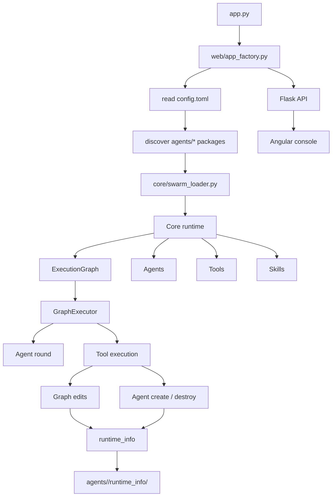

# Angelus Lunae

<div align="center">

<br />

# Angelus Lunae

### A multi-agent orchestration runtime with live graph editing, temporary agent creation, and runtime mutation tracking

[](https://python.org)
[](https://flask.palletsprojects.com)
[](https://angular.dev)
[](./index.md)

[📖 Docs Index](./index.md) · [🧭 API Structure](./api_structure.md) · [🧠 Metadata Reference](./metadata_reference.md) · [📦 Agent Layout](./agent_structure.md)

<br />


<br />

</div>

---

## Why Angelus?

> *"Complex collaboration should not only run. It should be visible, editable, and traceable."*

Angelus is not a plain agent scheduler. It is a runtime skeleton for swarm-style orchestration.
It keeps content generation separate from orchestration, static graph structure separate from runtime graph mutation, and agent behavior separate from graph edits.

It is a good fit if you want to keep pushing in these directions:

- Pluggable swarm packages
- Dynamic orchestration
- Runtime traceability
- Live execution flow
- Frontend/backend split

## Five-Minute Setup

### Install

```bash
python -m venv .lvenv
source .lvenv/bin/activate
pip install -r requirements.txt
```

### Configure

The root `config.toml` only tells the runtime where to discover swarm packages:

```toml
[app]
swarm_root = "agents"
```

### Start the backend

```bash
python app.py
```

The backend runs at `http://127.0.0.1:5000` and all APIs are mounted under `/api`.

### Open the console

Start the Angular frontend under `frontend/angelus/` and point its API base URL at `/api`.

## Core Features

### Swarm package model

Each swarm package is a standalone directory containing:

- `swarm.toml`
- one execution graph
- one or more agent definitions
- one or more skills
- one or more tools

### Dynamic graph orchestration

- edit the graph at runtime
- add / remove edges
- change entry / exit nodes
- inject a temporary agent into the live graph
- remove that temporary agent afterward

### Runtime recording

Every agent / tool / graph mutation is written to:

- `agents/<swarm_name>/runtime_info/current.json`
- `agents/<swarm_name>/runtime_info/events.jsonl`

This makes runtime state replayable, auditable, and debuggable.

### Web API

The backend provides:

- health checks
- swarm listing and details
- graph snapshots
- synchronous execution
- async run sessions
- SSE event streams
- single-agent round calls

### Angular console

The frontend is still a prototype console, but it can already:

- inspect swarm state
- trigger runs
- call one agent directly
- show API status and errors

## Architecture Overview



## Project Structure

```text
angelus/
├── app.py                 # backend entry point
├── config.toml            # root configuration
├── core/                  # runtime kernel
├── modules/               # infrastructure modules
├── tools/                 # default runtime tools
├── web/                   # Flask API
├── agents/                # loadable swarm packages
│   └── deepseek_demo/     # current demo package
├── frontend/              # Angular console
├── docs/                  # documentation
└── outputs/               # output artifacts
```

## Demo Package

The main demo package lives in `agents/deepseek_demo/` and shows a full execution chain:

1. `planner` produces a control plan
2. `agent_manager` creates a temporary `auditor`
3. `graph_editor` inserts that temporary agent into the live graph
4. `auditor` produces a conclusion
5. `agent_manager` deletes the temporary agent
6. `graph_editor` removes the temporary node
7. `publisher` emits the final answer
8. `file_writer` writes `outputs/deepseek_demo_final.txt`

The demo is designed to separate:

- content flow
- control flow
- graph mutation
- temporary agent lifecycle
- runtime persistence

### Example Task

If you want to test the current demo, you can use this task:

> Write a clear technical note about "a mutable multi-agent runtime".  
> Requirements:  
> 1. let the planner generate a control plan;  
> 2. create a temporary auditor agent for review;  
> 3. insert the auditor into the live graph at runtime;  
> 4. let the auditor output a substantive conclusion, not control instructions;  
> 5. delete the auditor and remove the corresponding node after the conclusion is produced;  
> 6. output a publish-ready note and write it to `outputs/deepseek_demo_final.txt`.

This task exercises:

- graph editing
- agent creation and deletion
- separation of content and control
- runtime_info persistence
- final output writing

## Roadmap

- [x] swarm package loading
- [x] runtime graph execution
- [x] live run sessions
- [x] SSE event streams
- [x] graph editing tools
- [x] agent create / destroy tools
- [x] runtime_info persistence
- [ ] richer frontend graph rendering
- [ ] clearer execution timelines
- [ ] stricter skill contract validation
- [ ] persistent runtime sessions
- [ ] more analysis-oriented default tools

## Documentation

- [Docs Index](./index.md)
- [API Structure](./api_structure.md)
- [Backend Reference](./backend_reference.md)
- [Frontend Reference](./frontend_reference.md)

## License

Angelus Lunae is released under the Apache 2.0 license.

- [LICENSE](../LICENSE)
- [LICENSE.zh-CN.md](../LICENSE.zh-CN.md)

