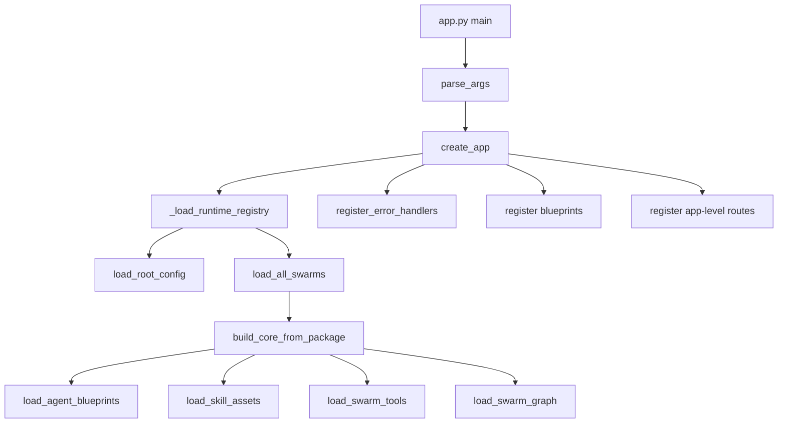
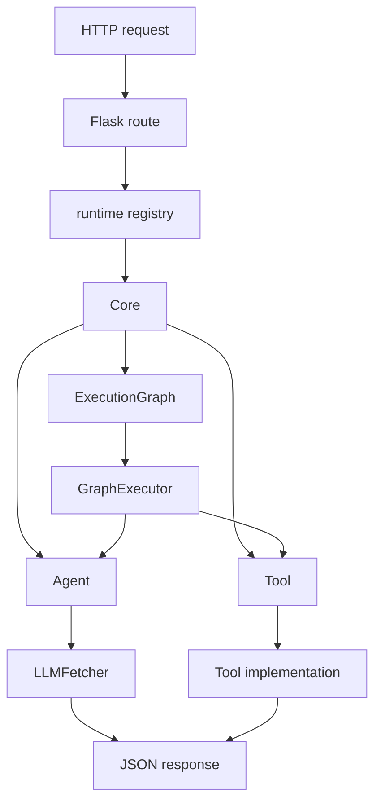
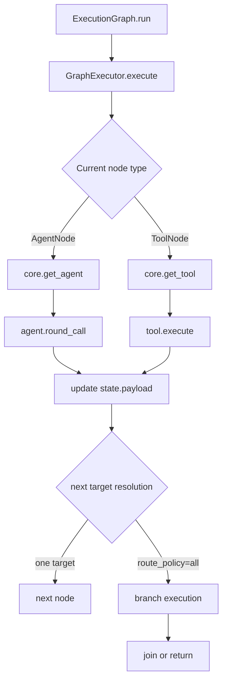

# Backend Reference

This document walks through the backend codebase file by file and summarizes the public classes, functions, inputs, behavior, and outputs.

## 1. High-Level Flow

### Startup Flow

### Request Dispatch Flow

### Graph Execution Flow

## 2. Entry File

### `app.py`

#### `parse_args() -> argparse.Namespace`

- Input: command-line options such as `--config`, `--host`, `--port`, and `--debug`
- Behavior: creates an `ArgumentParser`
- Output: parsed arguments

#### `main() -> None`

- Input: none
- Behavior: creates the Flask app and starts the development server
- Output: none; side effect is serving HTTP

## 3. Web Layer

### `web/__init__.py`

- Re-exports `create_app`
- Provides the web package entry point

### `web/app_factory.py`

#### `_load_runtime_registry(config_path: Path) -> Dict[str, object]`

- Input: path to the root `config.toml`
- Behavior:
  - loads root config
  - loads all swarms
  - indexes them by `swarm_name`
- Output: runtime registry dictionary

#### `create_app(config_path: str | Path = "config.toml") -> Flask`

- Input: config path
- Behavior:
  - creates the Flask app
  - loads the runtime registry
  - catches `SwarmLoaderError`
  - registers error handlers
  - registers blueprints
  - registers app-level routes
- Output: configured Flask app

#### App-level routes

- `index()`
- `api_index()`
- `api_swarms()`
- `api_swarm_detail(swarm_name)`
- `api_run_swarm(swarm_name)`
- `api_run_agent_round(swarm_name, agent_id)`

Each one resolves runtime state and returns JSON responses.

### `web/errors.py`

#### `ApiError(RuntimeError)`

- HTTP-friendly runtime error with a `status_code`

#### `ApiError.to_response()`

- Converts the error into a JSON response tuple

#### `NotFoundError(ApiError)`

- 404 wrapper

#### `ConflictError(ApiError)`

- 409 wrapper

#### `register_error_handlers(app)`

- Installs JSON error handlers for the Flask app

### `web/routes/health.py`

#### `health()`

- Returns `ok`

#### `ready()`

- checks runtime load status
- checks whether at least one swarm is available
- validates every graph

### `web/routes/swarms.py`

#### `_get_runtime_registry()`

- Reads the runtime registry from `app.extensions`

#### `_get_swarm_or_404(swarm_name)`

- Finds a swarm or raises `NotFoundError`

#### `list_swarms()`

- Lists all loaded swarms and graph validation info

#### `get_swarm(swarm_name)`

- Returns one swarm detail payload

#### `run_swarm(swarm_name)`

- Runs the selected graph synchronously

#### `run_agent_round(swarm_name, agent_id)`

- Runs one agent round directly

## 4. Core Runtime

### `core/config.py`

#### `AgentConfig`

- Holds shared backend config such as `api_url`, `api_key`, `model`, and `provider`

### `core/results.py`

#### `AgentContextSnapshot`

- Safe snapshot of an agent context

#### `AgentRoundResult`

- One agent round result

#### `ExecutionState`

- Runtime execution state container
- `clone()` returns a deep copy of the state

#### `GraphValidationResult`

- Graph validation result with `is_valid`, `errors`, and `warnings`

### `core/protocols.py`

#### `AgentLike`

- Protocol for objects that can be managed as agents
- Requires `round_call`, `get_context_snapshot`, and `reset_context`

### `core/agent.py`

#### `AgentContext`

- Local isolated context for one agent

#### `Agent.__init__(...)`

- Creates an agent with an LLM backend and a character prompt

#### `Agent.round_call(...)`

- Appends the user message to the context
- Builds the prompt
- Calls the LLM backend
- Stores the last round and turn count

#### `Agent.get_context_snapshot()`

- Returns a safe context snapshot

#### `Agent.reset_context()`

- Clears the local context

### `core/toodefl.py`

#### `ToolDefinition`

- Abstract runtime tool interface

#### `ToolContext`

- Carries `core`, `graph`, `rounds`, and `metadata` into tools

### `core/skills.py`

#### `SkillContract`

- Skill contract metadata such as schemas, dependencies, and policies

#### `SkillAsset`

- Prompt asset plus contract metadata

### `core/policy.py`

#### `Node`

- Basic graph node abstraction

#### `AgentNode`

- Node that points to an agent

#### `ToolNode`

- Node that points to a tool

#### `Edge`

- Directed connection between nodes

#### `ExecutionGraph`

- Graph structure, validation, mutation, and execution entry point

### `core/executor.py`

#### `GraphExecutor`

- Executes a graph from the current node
- Dispatches agent nodes, tool nodes, and branches

### `core/swarm_spec.py`

#### `SwarmManifest`

- Parsed swarm index file

#### `load_root_config(...)`

- Loads the root `config.toml`

#### `discover_swarm_packages(...)`

- Finds swarm packages under `agents/`

### `core/swarm_loader.py`

#### `load_all_swarms(...)`

- Builds runtime swarms from manifests and package files

#### `_preinstall_tool_requirements(...)`

- Installs tool requirements before runtime starts

## 5. Infrastructure Modules

### `modules/llm_fetcher/llm_fetcher.py`

#### `LLMFetcher`

- Async-friendly LLM gateway
- Supports backend routing, fallback, and streaming

### `modules/databaseman/database_manager.py`

#### `DatabaseManager`

- Async database wrapper

### `modules/redisman/redis_cache.py`

#### `RedisManager`

- Async Redis wrapper

## 6. Default Tools

### `tools/echo_tool.py`

- Echoes the input back

### `tools/file_writer_tool.py`

- Writes content to a file

### `tools/graph_editor_tool.py`

- Edits the live graph at runtime

### `tools/agent_manager_tool.py`

- Creates or deletes runtime agents

