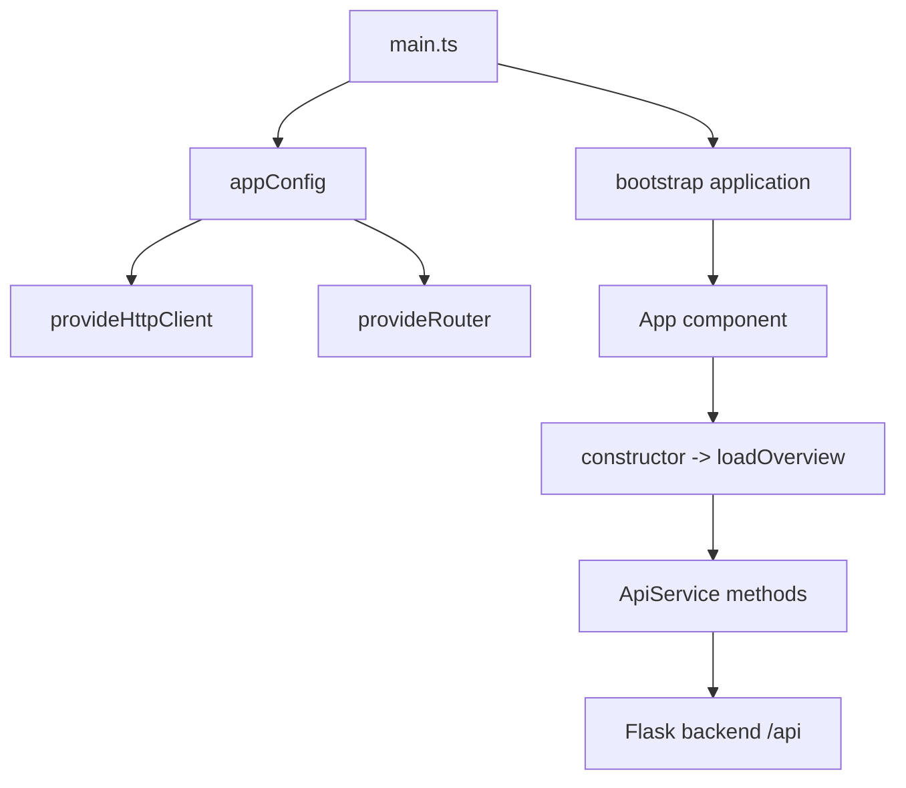
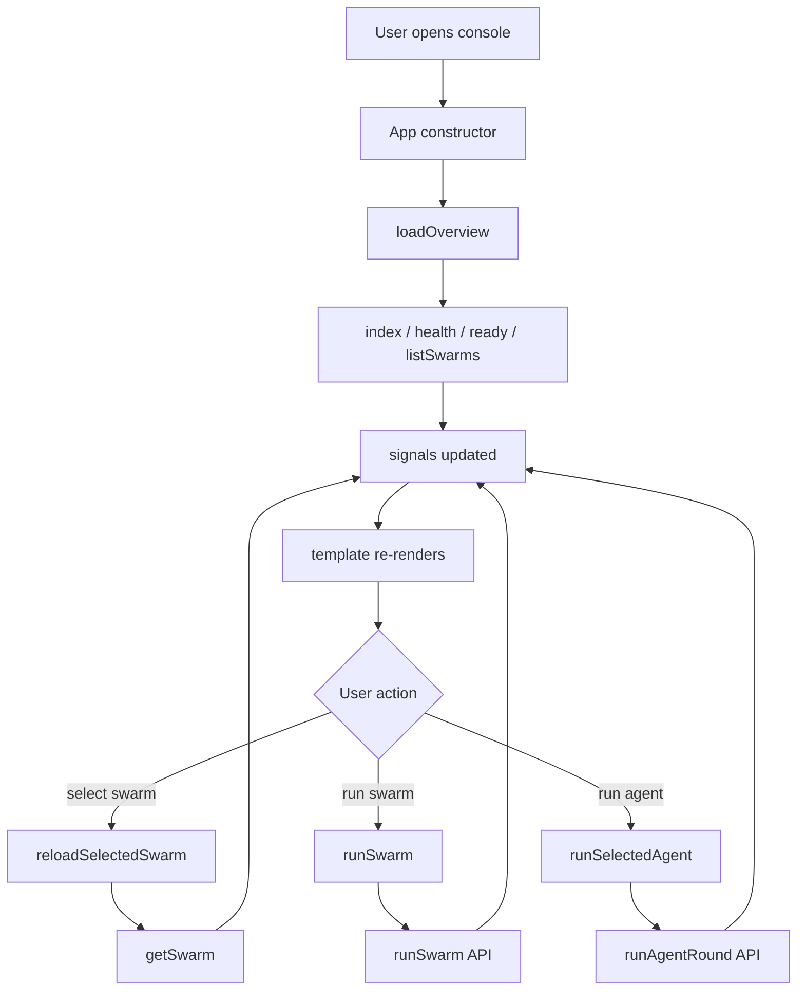

# Frontend Reference

This document summarizes the Angular frontend behavior, state flow, request wrapper, and page interaction.

## 1. High-Level Flow

### Frontend startup



### Page interaction



### Error handling

```mermaid
flowchart TD
    A[Http request fails] --> B[catch(error)]
    B --> C[formatError]
    C --> D{HttpErrorResponse?}
    D -->|yes| E[status + url + payload]
    D -->|no| F{Error instance?}
    F -->|yes| G[message]
    F -->|no| H[String(error)]
    E --> I[error signal]
    G --> I
    H --> I
    I --> J[UI error box]
```

## 2. Frontend Responsibilities

- read backend API state
- show the swarm registry and details
- trigger swarm execution
- trigger one agent round
- convert backend errors into readable text

The frontend does not execute runtime logic itself.

## 3. Startup and Configuration

### `main.ts`

- Angular application entry point
- bootstraps the app using `appConfig`

### `app.config.ts`

- registers browser error listeners
- registers the HTTP client
- registers the router

### `app.routes.ts`

- currently empty
- App is the only main view

### `proxy.conf.json`

- forwards `/api` to the Flask backend
- keeps the same path prefix in development

## 4. API Layer

### `api.types.ts`

Defines the JSON contracts used by the frontend.

### `api.service.ts`

Wraps all backend HTTP calls in business-friendly methods.

## 5. App Behavior

The `App` component:

- loads overview data at startup
- updates page state through signals
- renders swarm selection and detail panels
- exposes swarm run and agent round actions

## 6. Rendering Notes

The current frontend is still a prototype console. It is already good enough for:

- inspecting runtime state
- verifying API responses
- triggering swarm execution
- debugging one agent round

It still needs richer graph rendering and a better live execution timeline for production use.

