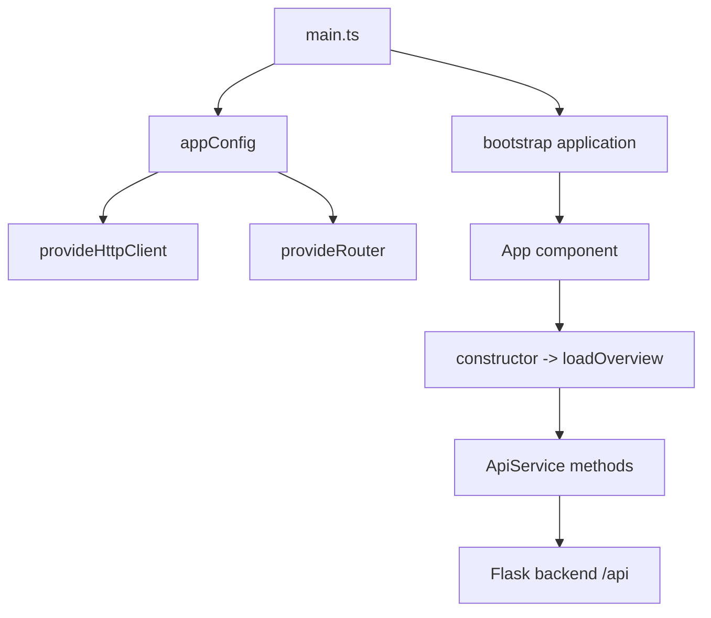
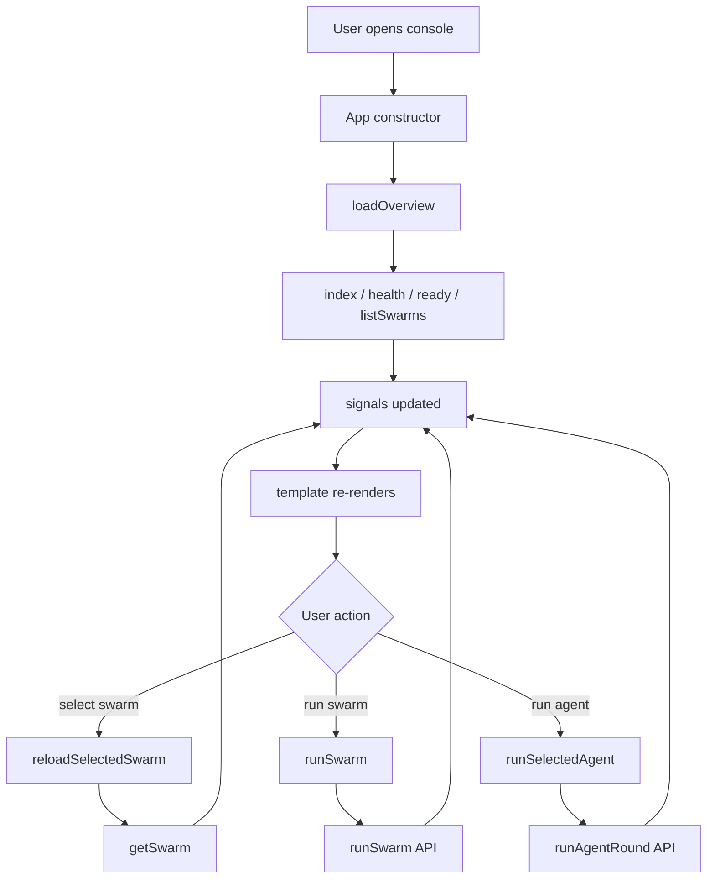

# 前端行为全量参考

本文档按代码实现梳理 Angular 前端的行为、状态流、请求封装和页面交互，并用 Mermaid 画出前端如何与后端 API 协作。

## 1. 总体流程图

### 1.1 前端启动流程



### 1.2 页面交互流程



### 1.3 错误处理流程

```mermaid
flowchart TD
    A[Http request fails] --> B[catch(error)]
    B --> C[formatError]
    C --> D{HttpErrorResponse?}
    D -->|yes| E[status + url + payload]
    D -->|no| F{Error instance?}
    F -->|yes| G[message]
    F -->|no| H[String(error)]
    E --> I[error signal]
    G --> I
    H --> I
    I --> J[UI error box]
```

## 2. 前端职责边界

当前前端的职责是：

- 读取后端 API 状态
- 展示 swarm registry 和详情
- 触发 swarm 运行
- 触发单个 agent round
- 把后端错误展示成可读文本

前端不负责：

- 解析 swarm 包
- 构建 runtime
- 执行 graph / agent / tool
- 处理运行时调度逻辑

这些都由 Flask 后端和 `core/` 运行时负责。

## 3. 启动与运行配置

### 3.1 `frontend/angelus/src/main.ts`

- 作用：Angular 应用的标准入口
- 行为：使用 `appConfig` 启动应用
- 输出：浏览器中的 Angular 应用

### 3.2 `frontend/angelus/src/app/app.config.ts`

#### `appConfig: ApplicationConfig`
- 输入内容：
  - `provideBrowserGlobalErrorListeners()`
  - `provideHttpClient()`
  - `provideRouter(routes)`
- 行为：
  - 注册浏览器全局错误监听
  - 注册 HTTP client
  - 注册 Angular Router
- 输出：Angular 依赖注入配置

### 3.3 `frontend/angelus/src/app/app.routes.ts`

- 当前导出：
  - `routes: Routes = []`
- 作用：
  - 当前没有前端路由页面拆分
  - App 是唯一主视图

### 3.4 `frontend/angelus/proxy.conf.json`

- 作用：
  - 开发服务器把 `/api` 转发到 `http://127.0.0.1:5000`
- 行为：
  - `changeOrigin: true`
  - 不重写路径
- 输出：
  - 让 Angular 和 Flask 共享 `/api` 根路径

### 3.5 `frontend/angelus/README.md`

- 作用：
  - 说明如何启动 Angular dev server
  - 说明 `/api` 代理策略
- 行为：
  - 文档性说明，不影响运行

## 4. API 封装层

### 4.1 `frontend/angelus/src/app/api.types.ts`

这些接口是前端与后端 JSON 的结构约定。

#### `HealthResponse`
- 字段：
  - `success`
  - `status`
- 作用：
  - 对应 `GET /api/health`

#### `ApiIndexResponse`
- 字段：
  - `success`
  - `service`
  - `swarm_count`
  - `load_error`
  - `api_root`
- 作用：
  - 对应 `GET /api`

#### `ReadyResponse`
- 字段：
  - `success`
  - `ready`
  - `swarm_count`
  - `reason`
  - `invalid_swarms`
- 作用：
  - 对应 `GET /api/ready`

#### `SwarmSummary`
- 字段：
  - `swarm_name`
  - `package_path`
  - `manifest_path`
  - `graph_file`
  - `agent_count`
  - `skill_count`
  - `tool_count`
  - `graph_attached`
  - `graph_valid`
  - `graph_errors`
  - `graph_warnings`
- 作用：
  - 对应 swarm 列表摘要

#### `SwarmDetails`
- 字段：
  - 继承 `SwarmSummary`
  - 额外包含 `agent_files`
- 作用：
  - 对应 swarm 详情

#### `SwarmListResponse`
- 字段：
  - `success`
  - `swarms`
- 作用：
  - 对应 `GET /api/swarms`

#### `SwarmDetailResponse`
- 字段：
  - `success`
  - `swarm`
- 作用：
  - 对应 `GET /api/swarms/<swarm_name>`

#### `RunSwarmRequest`
- 字段：
  - `input`
  - `rounds`
- 作用：
  - 对应 swarm 执行请求体

#### `RunSwarmResponse`
- 字段：
  - `success`
  - `swarm`
  - `rounds`
  - `output`
  - `trace`
  - `metadata`
- 作用：
  - 对应 `POST /api/swarms/<swarm_name>/run`

#### `AgentRoundRequest`
- 字段：
  - `message`
  - `rounds`
  - `additional_prompt`
- 作用：
  - 对应 agent round 请求体

#### `AgentRoundResponse`
- 字段：
  - `success`
  - `swarm`
  - `agent_id`
  - `result`
  - `context`
- 作用：
  - 对应 `POST /api/swarms/<swarm_name>/agents/<agent_id>/round`

### 4.2 `frontend/angelus/src/app/api.service.ts`

#### `ApiService`
- 作用：
  - 把 HTTP 调用统一封装成业务方法
  - 让组件层不直接拼接 URL

#### `index(baseUrl = '/api')`
- 输入：API 根路径
- 内部行为：`GET {baseUrl}`
- 输出：`Promise<ApiIndexResponse>`

#### `health(baseUrl = '/api')`
- 输入：API 根路径
- 内部行为：`GET {baseUrl}/health`
- 输出：`Promise<HealthResponse>`

#### `ready(baseUrl = '/api')`
- 输入：API 根路径
- 内部行为：`GET {baseUrl}/ready`
- 输出：`Promise<ReadyResponse>`

#### `listSwarms(baseUrl = '/api')`
- 输入：API 根路径
- 内部行为：`GET {baseUrl}/swarms`
- 输出：`Promise<SwarmListResponse>`

#### `getSwarm(baseUrl, swarmName)`
- 输入：
  - API 根路径
  - `swarmName`
- 内部行为：`GET {baseUrl}/swarms/{swarmName}`
- 输出：`Promise<SwarmDetailResponse>`

#### `runSwarm(baseUrl, swarmName, request)`
- 输入：
  - API 根路径
  - `swarmName`
  - `RunSwarmRequest`
- 内部行为：`POST {baseUrl}/swarms/{swarmName}/run`
- 输出：`Promise<RunSwarmResponse>`

#### `runAgentRound(baseUrl, swarmName, agentId, request)`
- 输入：
  - API 根路径
  - `swarmName`
  - `agentId`
  - `AgentRoundRequest`
- 内部行为：`POST {baseUrl}/swarms/{swarmName}/agents/{agentId}/round`
- 输出：`Promise<AgentRoundResponse>`

## 5. 页面组件行为

### 5.1 `frontend/angelus/src/app/app.ts`

#### `App`
- 作用：
  - 单页控制台组件
  - 管理页面状态、请求调度和错误显示

#### 主要 state signals

- `title`
  - 页面标题
- `apiBaseUrl`
  - 当前 API 根路径，默认 `/api`
- `loading`
  - 全局加载状态
- `error`
  - 当前错误文本
- `apiIndex`
  - API 首页结果
- `health`
  - health 结果
- `ready`
  - ready 结果
- `swarms`
  - 已加载 swarm 列表
- `selectedSwarmName`
  - 当前选中 swarm 名称
- `selectedSwarm`
  - 当前选中 swarm 详情
- `selectedAgentId`
  - 当前选中 agent
- `swarmRunOutput`
  - swarm 执行结果
- `agentRunOutput`
  - agent round 结果
- `swarmInput`
  - swarm 运行输入 JSON 文本
- `swarmRounds`
  - swarm 运行初始轮次
- `agentMessage`
  - 单 agent round 的消息
- `agentRounds`
  - 单 agent round 的初始轮次
- `agentAdditionalPrompt`
  - 单 agent round 的额外提示词

#### `availableAgentIds`
- 类型：computed signal
- 输入：`selectedSwarm`
- 内部行为：
  - 从 `agent_files` 里推导 agent 文件名
  - 去掉扩展名
- 输出：可选 agent id 列表

#### `selectedSummary`
- 类型：computed signal
- 输入：`selectedSwarmName` 和 `swarms`
- 内部行为：在列表中找对应 swarm 摘要
- 输出：当前选中 swarm 的摘要

#### `constructor()`
- 输入：无
- 内部行为：
  - 在组件创建时立即调用 `loadOverview()`
- 输出：无

#### `loadOverview()`
- 输入：无
- 内部行为：
  - 设置 `loading = true`
  - 清空 error
  - 并发请求：
    - `index`
    - `health`
    - `ready`
    - `listSwarms`
  - 成功后写入各个 signal
  - 如果列表非空则自动选择第一个 swarm
  - 失败时把错误格式化后写入 `error`
- 输出：无；副作用是刷新页面概览

#### `selectSwarm(swarmName)`
- 输入：`swarmName`
- 内部行为：
  - 设置 `selectedSwarmName`
  - 调用 `reloadSelectedSwarm()`
- 输出：无

#### `reloadSelectedSwarm()`
- 输入：无
- 内部行为：
  - 若无选中 swarm 则清空详情
  - 调 `getSwarm`
  - 成功后写入 `selectedSwarm`
  - 继续调用 `syncAgentDefaults`
- 输出：无

#### `runSwarm()`
- 输入：无，读取当前 state
- 内部行为：
  - 校验当前是否选中了 swarm
  - 解析 `swarmInput` 为 JSON
  - 调 `runSwarm`
  - 将结果写入 `swarmRunOutput`
  - 失败则写入 error
- 输出：无

#### `runSelectedAgent()`
- 输入：无，读取当前 state
- 内部行为：
  - 校验 swarm 和 agent 是否存在
  - 调 `runAgentRound`
  - 将结果写入 `agentRunOutput`
  - 失败则写入 error
- 输出：无

#### `trackBySwarmName(_: number, item: SwarmSummary)`
- 输入：循环索引和 swarm
- 内部行为：返回 `swarm_name` 作为 track key
- 输出：字符串

#### `prettyJson(value)`
- 输入：任意值
- 内部行为：`JSON.stringify(value, null, 2)`
- 输出：格式化 JSON 字符串或空字符串

#### `setSwarmRounds(value)`
- 输入：输入框值
- 内部行为：转成数字并写入 `swarmRounds`
- 输出：无

#### `setAgentRounds(value)`
- 输入：输入框值
- 内部行为：转成数字并写入 `agentRounds`
- 输出：无

#### `syncAgentDefaults(swarm)`
- 输入：`SwarmDetails`
- 内部行为：
  - 选中 `planner`，如果存在
  - 否则选第一个 agent
  - 如果选到 planner，自动替换默认 agent message
- 输出：无

#### `parseJson(value)`
- 输入：字符串
- 内部行为：
  - 去掉空白
  - 空字符串返回 `{}`
  - 否则 `JSON.parse`
- 输出：对象或抛异常

#### `toNumber(value)`
- 输入：任意值
- 内部行为：转数字，非法则返回 `0`
- 输出：数字

#### `formatError(error)`
- 输入：任意错误对象
- 内部行为：
  - 若是 `HttpErrorResponse`，组装状态码、URL 和后端 payload
  - 若是普通 `Error`，返回 message
  - 否则尝试 JSON 化或字符串化
- 输出：可读错误文本

#### `describeHttpErrorPayload(payload)`
- 输入：HTTP 错误 payload
- 内部行为：
  - 优先取 `error` / `message` / `reason` / `detail`
  - 否则 JSON stringify
- 输出：可读错误文本或 `null`

## 6. 模板行为

### 6.1 `frontend/angelus/src/app/app.html`

- 作用：
  - 定义整页控制台布局
  - 绑定所有 signal 和组件方法
- 行为：
  - 显示 API root、health、ready、swarm 数量
  - 显示 swarm registry 列表
  - 显示选中 swarm 详情
  - 提供 swarm 执行区域
  - 提供 agent round 执行区域
  - 显示 API root / swarm result / agent result
  - 显示错误框

#### 关键模板交互
- `Refresh overview`
  - 触发 `loadOverview()`
- `Reload swarm`
  - 触发 `reloadSelectedSwarm()`
- 点击 swarm registry item
  - 触发 `selectSwarm(swarm.swarm_name)`
- `Run swarm`
  - 触发 `runSwarm()`
- `Run selected agent`
  - 触发 `runSelectedAgent()`
- `Run agent`
  - 也触发 `runSelectedAgent()`

## 7. 样式行为

### 7.1 `frontend/angelus/src/app/app.sass`

- 作用：
  - 定义整页控制台视觉风格
- 行为：
  - 深色背景 + 渐变光晕
  - 卡片式布局
  - 响应式 grid
  - 输入框、按钮、徽章、错误框样式
- 输出：
  - 视觉上更偏仪表盘/控制台风格的页面

## 8. 测试行为

### 8.1 `frontend/angelus/src/app/app.spec.ts`

- 作用：
  - 验证 App 组件能创建
  - 验证标题能渲染
- 内部行为：
  - 用假的 `ApiService` 提供稳定返回值
  - 避免真实后端依赖
- 输出：
  - Angular 单元测试结果

## 9. 当前前端的行为总结

- 前端是单页控制台，没有复杂路由拆分
- 所有数据源都来自 `/api`
- 页面初始化时自动加载概览
- 用户可以：
  - 切换 swarm
  - 查看 swarm 详情
  - 运行整个 swarm
  - 单独运行某个 agent
- 错误信息会尽量被格式化成可读文本
- `proxy.conf.json` 和后端 `/api` 前缀保持一致

## 10. 前后端协作关系

- 前端只负责调用和展示
- 后端负责装载、校验和执行
- 前端的 `ApiService` 方法与后端 API 一一对应
- 前端 `App` 状态与后端返回 JSON 一一对应

