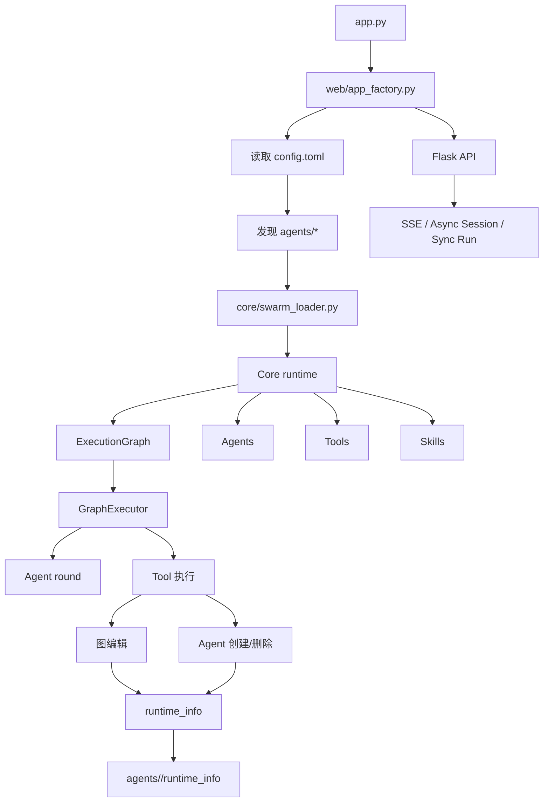
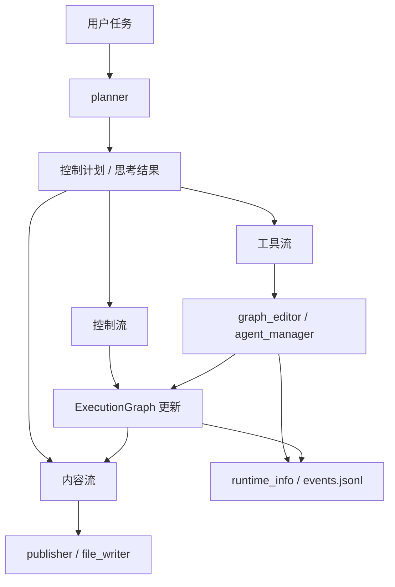
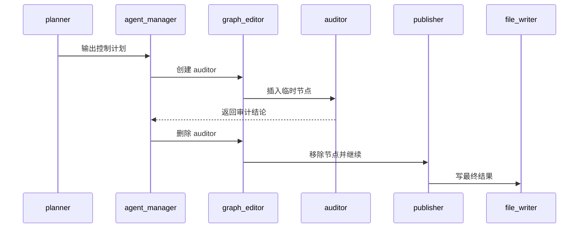
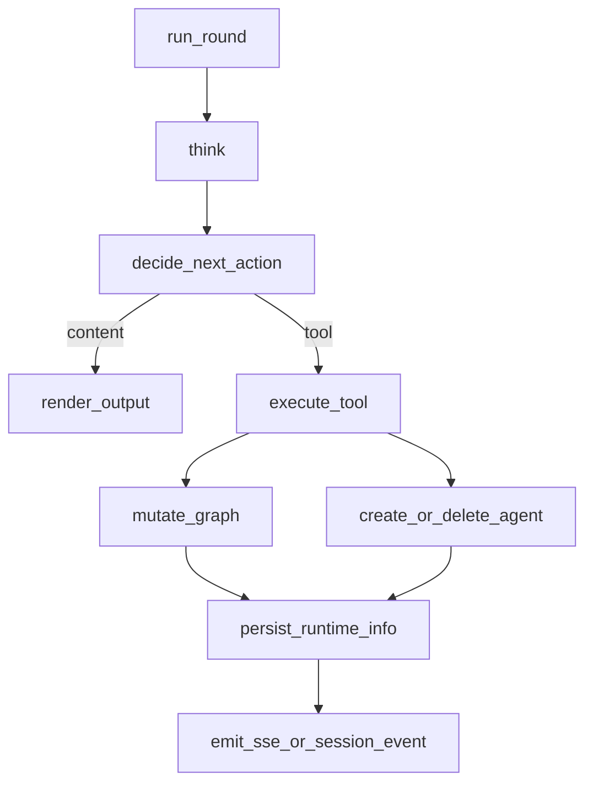

# luna-agent-base 后端诊断与系统化重构报告

## 执行摘要

`luna-agent-base` 当前把自己定位成一个“支持动态改图、临时 agent 生成与运行时记录的多智能体编排运行时”：后端入口是 `app.py`，通过 `web/app_factory.py` 启动 Flask API；配置由 `config.toml` 提供 swarm 根目录；运行时核心包含 `ExecutionGraph`、`GraphExecutor`、Agents、Tools、Skills；运行时状态会写入 `agents/<swarm_name>/runtime_info/current.json` 与 `events.jsonl`；对外 API 已覆盖健康检查、swarm 列表与详情、graph 快照、同步执行、异步 run session、SSE 事件流和单 agent round 调用。README 还明确给出 `deepseek_demo` 的完整演示链：`planner → agent_manager → graph_editor → auditor → agent_manager → graph_editor → publisher → file_writer`。citeturn20view0turn13view3turn53view1

这个架构最值得肯定的点，不是“多智能体”本身，而是它试图把四类东西分开表达：内容生成、控制编排、静态图、运行时图、以及 agent 行为和 graph 变更。也就是说，作者已经意识到普通“Agent = 对话 + 工具调用”的抽象不够了，必须把“控制面”从“内容面”里抽出来；这是一个非常正确、而且罕见地提前到位的方向。citeturn13view3

但同样因为它走向了“运行时 + 图执行器 + 动态改图 + 临时 agent 生命周期 + 异步 session + SSE + runtime tracing”的组合，后端天然面临三个高度集中的复杂性热点：其一，Agent 抽象极易膨胀成 God Object；其二，`GraphExecutor` 很容易同时承担图遍历、动作执行、状态回写和事件发射；其三，tool 层如果直接变更图和 agent 注册表，就会把业务逻辑、运行时状态和持久化耦成一个大事务边界。这一判断是基于 README 中已经公开的功能面与 demo 行为做出的架构级诊断；具体到类内圈复杂度与方法数，当前公开索引未暴露源码正文，因此不能冒充逐行审计。citeturn13view3turn53view1turn50view2

我给出的总体建议是：**保留“图驱动运行时”的核心思想，但把后端重构成清晰的五层结构**——引导层、Web/API 层、应用编排层、领域运行时层、基础设施适配层；同时把当前过重的 Agent 降级为**不可变规格 + 单轮执行器**，把“改图、增删临时 agent、写 runtime_info、推送 SSE”从 Agent/执行器主体中拆出，收敛到独立服务与命令模型；最后用“表征测试 + 双写 + 特性开关”的方式做渐进迁移，而不是一次性重写。这样既不背离项目原始方向，也能显著提高可测试性、并发安全性和后续演进速度。citeturn13view3turn53view1

## 研究范围与证据边界

本报告严格遵守“**静态分析 only**、**不修改仓库**、**运行时不臆测**”的约束。可直接观测的一手证据来自 entity["company","GitHub","code hosting platform"] 仓库主页、README 渲染内容、仓库根目录文件树、公开可见的文档路径、以及目录/文档页路径本身；可确认仓库根目录至少包含 `agents/`、`core/`、`docs/`、`frontend/angelus/`、`modules/`、`outputs/`、`skills/frontend-production/`、`tools/`、`web/`、`app.py`、`config.toml`、`next_plan.md`、`requirements.txt`，并显示为 17 次提交的公开仓库。citeturn20view0

同时必须坦率说明本次证据边界：我能够确认 `core/`、`modules/`、`tools/`、`web/`、`agents/` 这些目录存在，也能确认 `docs/index.md`、`docs/README.en.md`、`docs/api_structure.md`、`docs/backend_reference.md`、`docs/frontend_reference.md`、`docs/metadata_reference.md`、`docs/agent_structure.md` 这些文档路径存在；但是当前公开可检索结果没有把这些 Python/Markdown 文件正文直接展开出来，所以**类定义、方法签名、静态方法、独立函数、全局变量**无法做到真正“逐文件、逐定义、逐引用位点”的代码级盘点。下面的 inventory 因此分为“已确认项”和“待源码正文可读后补全项”。这不是推理能力问题，而是证据可见性边界。citeturn15view0turn49view0turn50view0turn50view1turn50view2turn50view3turn54view0turn54view1turn54view2turn54view3turn54view4

| 证据层级 | 当前可严谨确认的内容 | 当前不能严谨确认的内容 | 对诊断的影响 |
|---|---|---|---|
| 仓库级 | 根目录结构、README 架构概览、Demo 链路、API 能力、runtime_info 路径、文档路径。citeturn20view0turn13view3turn53view1turn49view0turn50view0turn50view1turn50view2turn50view3 | 目录内每个 Python 文件正文。 | 足够做架构级诊断与重构蓝图。 |
| 代码级 | `app.py`、`web/app_factory.py`、`core/swarm_loader.py` 这些关键入口/模块名；`ExecutionGraph`、`GraphExecutor` 这些关键类名；Demo 中 agent/tool 名。citeturn53view1turn13view3 | 类方法列表、函数实现、全局变量、真实调用点。 | 无法宣称“已完成逐方法 call graph 审计”。 |
| 测试级 | 根目录未展示 `tests/` 顶层目录。citeturn20view0 | 是否存在嵌套测试目录与 CI 工作流配置。 | 只能保守判断“测试不是当前公开顶层结构的主导入口”。 |

从这个边界出发，下面所有“已确认事实”都会引用源码一手页面；所有“热点原因、职责冲突、重构方案、工作量预估”都将明确标注为**基于这些事实的分析结论**，而不会伪装成已经看到的源码正文。citeturn20view0turn13view3turn53view1

## 当前架构与执行流

本报告前置的三张图，分别对应：总体执行图、思考流图、以及 `deepseek_demo` 时序图。它们都依据 README 公开给出的架构概览、API 列表和 Demo 链路重建；其中“Agent 语义方法层”的部分属于保守推断，不代表已核实名字，而是为了帮助重构讨论聚焦职责边界。citeturn13view3turn53view1

从启动路径看，当前系统是一个典型的“**入口脚本 → App 工厂 → 配置 → Swarm 发现 → 运行时核心**”结构；从运行路径看，它是一个“**执行图驱动 + tool 允许改图 + 运行时可追踪**”的系统；从对外交互看，它同时兼顾了同步执行、长会话、流式事件和单轮 agent 调用，因此后端并不是单纯的 API wrapper，而是一个真正的 runtime。citeturn53view1turn13view3



从数据流看，README 明确强调“内容流”和“控制流”分离：`planner` 先产生控制计划，然后 `agent_manager` 与 `graph_editor` 在运行时插入和删除临时 `auditor`，之后才由 `publisher` 产出最终内容并由 `file_writer` 落盘。换言之，系统的关键不是“多个 agent 依次说话”，而是“**计划—控制—改图—生成—收尾**”这一条复合数据流。citeturn13view3



README 给出的 `deepseek_demo` 实际上已经暴露了当前运行时最重要的“控制面协议”：临时 agent 的创建、插入、执行、删除，以及相应图节点的增删，不是后台辅助手段，而是主工作流的一部分。这说明未来任何后端重构，如果不能把“agent 生命周期命令”和“graph mutation 命令”从普通 tool 返回值里提升为一等概念，复杂度只会越来越高。citeturn13view3



如果把 README 暴露的功能语义进一步压缩成“当前 Agent/执行器的职责图”，它大致会长成下面这样。这里的 `think()`、`execute_tool()`、`mutate_graph()`、`persist_runtime_info()` 不是已核实名字，而是我根据当前公开行为重建出的**语义方法层**；它恰好说明为什么我认为 Agent 抽象当前大概率过重。citeturn13view3turn53view1



## 组件清单与接口盘点

先说结论：**当前能做严谨盘点的是“组件级 inventory”，而不是“完整源码定义 inventory”**。原因前面已经交代过：目录和关键文件路径公开可见，但 `core/*`、`modules/*`、`tools/*`、`web/*`、`agents/*` 内部文件正文没有在当前公开索引里展开。因此，下表会尽可能把已确认模块、类名、运行时工件、业务节点和接口都列出来，并在“签名/接口”栏明确标注“未公开”或“待源码补齐”，而不会虚构方法签名。citeturn20view0turn13view3turn53view1turn54view0turn54view1turn54view2turn54view3turn54view4

| 项 | 种类 | 路径 / 归属 | 签名 / 接口 | 目的 | 输入 / 输出 | 副作用 | 耦合 / 使用位点 | 证据 |
|---|---|---|---|---|---|---|---|---|
| `app.py` | 模块 | 仓库根目录 | 未公开 | 后端启动入口 | 输入：配置/环境；输出：HTTP 服务进程 | 启动应用 | 调用 `web/app_factory.py` | citeturn20view0turn53view1 |
| `config.toml` | 配置文件 | 仓库根目录 | `[app].swarm_root = "agents"` | 指定 swarm 根目录 | 输入：静态配置；输出：发现路径 | 影响启动加载 | 被 app factory / loader 读取 | citeturn20view0turn53view1 |
| `web/app_factory.py` | 模块 | `web/` | 未公开 | 组装 Flask 应用与 API | 输入：配置、swarm 发现结果；输出：Flask app | 注册路由、启动 API 层 | `app.py` 直接依赖；面向前端 | citeturn53view1turn54view3 |
| `core/swarm_loader.py` | 模块 | `core/` | 未公开 | 发现并加载 swarm 包 | 输入：`agents/*` 路径；输出：运行时组件 | 读取目录/元数据 | 依赖 `agents/`；供 runtime 使用 | citeturn53view1turn54view0turn54view4 |
| `ExecutionGraph` | 类名已确认 | `core/*` | 具体构造器未公开 | 表示执行图 | 输入：节点/边/入口出口；输出：图状态 | 图结构持久化/变更 | 被 `GraphExecutor` 和图编辑工具使用 | citeturn53view3turn13view3 |
| `GraphExecutor` | 类名已确认 | `core/*` | 具体方法未公开 | 驱动工作图执行 | 输入：图 + 运行时状态；输出：轮次推进结果 | 调用 agent/tool，可能触发改图 | 依赖 `ExecutionGraph`、Agents、Tools | citeturn53view2turn13view3 |
| Agents registry | 运行时组件 | `core/*` / `agents/*` | 未公开 | 管理可执行 agent | 输入：swarm agent 定义；输出：可调度对象 | 注册/删除临时 agent | 与 demo 中 `agent_manager` 耦合 | citeturn13view3turn53view1 |
| Tools registry | 运行时组件 | `tools/*` | 未公开 | 管理 tool 能力 | 输入：tool 定义；输出：可调用动作 | 可能直接改图或改 agent 集合 | 与 `graph_editor`、`agent_manager` 耦合 | citeturn13view3turn54view2 |
| Skills registry | 运行时组件 | `skills/*` | 未公开 | 组织 skill 能力 | 输入：skill 定义；输出：可绑定能力 | 运行时增强 | 与 Agents 绑定 | citeturn20view0turn53view1 |
| `runtime_info/current.json` | 运行时工件 | `agents/<swarm>/runtime_info/` | JSON 结构未公开 | 当前状态快照 | 输入：运行时状态；输出：当前快照 | 文件写入 | 被 tracing / debug / 前端或诊断使用 | citeturn13view3turn53view1 |
| `runtime_info/events.jsonl` | 运行时工件 | `agents/<swarm>/runtime_info/` | JSONL 事件结构未公开 | 事件追踪日志 | 输入：agent/tool/graph 变化；输出：事件流 | 文件追加写入 | 与审计、回放、调试紧耦合 | citeturn13view3turn53view1 |
| `agents/deepseek_demo/` | 业务包 | `agents/` | package 结构未公开 | 演示完整运行链 | 输入：任务文本；输出：最终文稿 | 动态改图、创建/删除 agent、写文件 | 当前主 demo | citeturn13view3turn54view4 |
| `planner` | Agent 节点 | `deepseek_demo` | 未公开 | 生成控制计划 | 输入：用户任务；输出：控制计划 | 影响后续路由 | demo 首节点 | citeturn13view3 |
| `agent_manager` | Agent 或 Tool 节点 | `deepseek_demo` | 未公开 | 创建 / 删除临时 agent | 输入：控制计划 / 状态；输出：agent 生命周期命令 | 变更 agent 集合 | 与 `graph_editor` 强耦合 | citeturn13view3 |
| `graph_editor` | Tool 节点 | `deepseek_demo` | 未公开 | 在运行时改图 | 输入：图编辑命令；输出：更新后图 | 变更图结构 | 与 `ExecutionGraph` 强耦合 | citeturn13view3 |
| `auditor` | 临时 Agent | `deepseek_demo` | 未公开 | 复核内容并产出结论 | 输入：当前内容；输出：审计结论 | 临时生命周期 | 被动态插入 / 删除 | citeturn13view3 |
| `publisher` | Agent 节点 | `deepseek_demo` | 未公开 | 输出最终答案 | 输入：审计后内容；输出：发布稿 | 产生最终文本 | 在移除临时节点后继续 | citeturn13view3 |
| `file_writer` | Tool 节点 | `deepseek_demo` | 未公开 | 写最终结果文件 | 输入：最终文本；输出：文件 | 写入 `outputs/deepseek_demo_final.txt` | demo 尾节点 | citeturn13view3 |
| `/api` 健康检查 | API 能力 | `web/*` | 路径/方法未公开 | 检查服务可用性 | 输入：HTTP 请求；输出：健康状态 | 无或轻微 | 前端/运维依赖 | citeturn53view1 |
| `/api` swarm 列表与详情 | API 能力 | `web/*` | 路径/方法未公开 | 暴露 swarm 元数据 | 输入：HTTP 请求；输出：swarm 信息 | 读配置/读运行时 | 前端控制台依赖 | citeturn53view1 |
| `/api` graph 快照 | API 能力 | `web/*` | 路径/方法未公开 | 暴露当前图 | 输入：HTTP 请求；输出：图快照 | 读取图状态 | 前端图谱依赖 | citeturn53view1 |
| `/api` 同步执行 | API 能力 | `web/*` | 路径/方法未公开 | 一次性 run | 输入：任务；输出：执行结果 | 运行 agent/tool | 业务入口 | citeturn53view1 |
| `/api` 异步 run session | API 能力 | `web/*` | 路径/方法未公开 | 长会话执行 | 输入：任务；输出：session 句柄 | 持续占用运行时状态 | 与 SSE 强耦合 | citeturn53view1 |
| `/api` SSE 事件流 | API 能力 | `web/*` | 路径/方法未公开 | 实时推送运行事件 | 输入：session / runtime 事件；输出：SSE | 持续连接、事件序列化 | 与 runtime tracing 强耦合 | citeturn53view1 |
| `/api` 单 agent round 调用 | API 能力 | `web/*` | 路径/方法未公开 | 调试或局部调用 | 输入：agent + payload；输出：round 结果 | 可能绕开完整图执行 | 调试与控制台依赖 | citeturn53view1 |

对“所有类方法、静态方法、独立函数、全局变量”的更细 inventory，我建议在源码正文可见后立刻补一遍 AST 清单，字段应至少包括：`file_path`、`qualname`、`kind`、`signature`、`return_type`、`side_effects`、`imports`、`called_by`、`mutates_state`、`io_boundary`。在当前证据边界内，把这些字段写成“已知未知”比随意猜签名更严谨。citeturn54view0turn54view1turn54view2turn54view3turn54view4

## 热点诊断

我把热点分成五类，其中第一类就是你特别点名的 Agent。需要再次强调：这里的诊断是**架构级热点诊断**，不是已看到源码后的“某一行该怎么改”；但它已经足够指导重构优先级。支撑这些判断的公开事实，是项目明确支持动态改图、临时 agent 生成/删除、运行时持久化、异步 run session、SSE 流，以及 demo 中完整的临时节点生命周期。citeturn13view3turn53view1

| 热点 | 为什么危险 | 具体问题类型 | 我给出的结论 |
|---|---|---|---|
| Agent 类 / Agent 抽象 | 既要“思考”，又要“调用工具”，还要“参与改图/增删 agent/回写 tracing”时，极易膨胀成单对象统摄控制面和内容面。 | 单一职责违背、圈复杂度上升、mock 困难、局部修复容易引入全局回归。 | 这是**最高优先级热点**。 |
| `GraphExecutor` | 只要执行器同时承担图遍历、动作提交、状态推进、事件发射、异常恢复，它就会成为第二个 God Object。 | 耦合过深、失败语义模糊、重试边界不清。 | 必须拆成“遍历器 + 动作提交器 + 状态归并器”。 |
| Tool 直连运行时可变状态 | 当前 README 已明确 tool 能改图，也能创建/删除 agent。 | 副作用边界不透明、权限模型不清、并发下不安全。 | 必须经过命令层/事务边界，而不应直接改内存对象。 |
| `runtime_info` 文件持久化 | 系统把运行时追踪落到 `current.json` 和 `events.jsonl`。这是好事，但如果写入逻辑嵌在执行热路径里，会拖慢执行且易产生部分写。 | 性能、原子性、文件损坏恢复、会话间竞争。 | 应抽成 `TraceStore`，并处理原子替换与追加刷盘策略。 |
| API / Session / SSE 混杂 | 同时支持同步 run、异步 session、SSE 和单轮 round，说明 Web 层很容易直接感知内部状态机。 | 表现层侵入领域层、接口回归风险高、长连接与状态一致性问题。 | 应做 SessionStore 与 EventBroker 抽象，Web 只负责适配。 |

### Agent 类为何最可能过度设计

从 README 的功能面看，当前 Agent 不是简单“拿 prompt 出文本”的对象，而是整个 runtime 中最可能跨越三条边界的对象：**思考边界、工具边界、运行时变更边界**。只要这些边界没有被服务层吃掉，Agent 类就会自然长成这样：既要知道图结构，又要知道 tool schema，又要知道 tracing，又要知道 session 事件，这会让任何单元测试都变成“启动半个系统才能测一个 round”。citeturn13view3turn53view1

这类设计的最坏结果不是“代码不好看”，而是**语义漂移**：你修一个“让 auditor 正常删除”的 bug，结果不小心改坏了 SSE 推送顺序；你加一个 tool，结果打破了 `runtime_info/current.json` 的稳定结构；你为了支持新 session 模式改 Agent，结果影响了同步 run。也就是说，问题不是体量，而是**控制面穿过了太多层**。这是为什么我建议让 Agent 退化为“不可变规格 + 单轮执行器”，而不是继续让它担任 runtime 的行为中心。citeturn13view3turn53view1

### `GraphExecutor` 为何会成为第二个重灾区

README 的架构图把 `GraphExecutor` 放在 `ExecutionGraph` 之后，同时连接 “Agent round”“Tool 执行”“图编辑”“Agent 创建/删除”。这几条边一旦都在执行器内部完成，执行器就不再只是“走图”，而是成为**调度器 + 事务管理器 + 副作用编排器**。这会让错误恢复格外难：失败到底发生在 round 之前、tool 调用中、还是图已经改了但 tracing 还没写？如果没有硬分层，根本说不清。citeturn53view2turn53view3turn13view3

### Tool-Driven Mutation 为何需要升级成命令模型

当前 demo 中的 `agent_manager` 和 `graph_editor` 其实已经等于两个“运行时写命令”：一个负责 agent registry 变更，一个负责 graph mutation。把这种行为继续伪装成普通 tool，会造成一个长期问题：工具返回值既可能是内容，也可能是控制命令，还可能是半结构化副作用描述。随着系统增长，这会让每个调用方都需要理解这些“隐含命令”，从而在全系统扩散复杂度。更合理的做法，是让 tool 只能返回**显式命令对象**，再由 mutation service 统一应用。citeturn13view3

## 重构蓝图

重构目标不是把项目“改成另一个框架”，而是把它已经正确识别出的三类一等对象——**图、运行时命令、追踪事件**——正式制度化。换句话说，保留“swarm 包 + execution graph + 动态图编辑 + runtime_info”的核心模型，但把现在横向缠绕的职责切成垂直层。这样可以最大化复用现有概念和前端契约，同时最小化认知迁移成本。citeturn13view3turn53view1

### 目标分层

| 层 | 建议目录 | 职责 | 不应该做什么 |
|---|---|---|---|
| 引导层 | `bootstrap/` | 读配置、组装依赖、创建 app | 不做业务判断 |
| Web/API 层 | `web/` | HTTP、SSE、请求校验、响应序列化 | 不直接改图、不直接写 tracing |
| 应用编排层 | `application/` | `run_swarm`、`run_round`、`mutate_graph`、`create_temp_agent` 这些 use case | 不持有 Flask 对象 |
| 领域运行时层 | `domain/` | `ExecutionGraph`、`NodeSpec`、`AgentSpec`、`RuntimeState`、`RuntimeCommand`、`TraceEvent` | 不触碰文件系统和 HTTP |
| 基础设施层 | `infrastructure/` | 文件读写、事件存储、swarm 加载、LLM/工具适配 | 不做业务编排 |

### Agent 的三种简化路线

| 方案 | 核心思想 | 优点 | 缺点 | 适用性 |
|---|---|---|---|---|
| 薄 Agent + `AgentRunner` | `Agent` 只保留不可变 spec；执行逻辑在 runner/policy/dispatcher | 改动最稳，最适合渐进迁移 | 类数量增加 | **推荐，第一阶段首选** |
| `NodeExecutor` 统一节点模型 | agent/tool/human/manual 节点都统一成 executor | 领域模型最干净，最利于图执行 | 迁移量较大 | 第二阶段可以演进到这里 |
| Actor / Session 隔离 | 每个 agent 或 session 持有独立上下文与消息箱 | 并发强、隔离好 | 复杂度过高，现阶段过度工程 | 当前不建议 |

我建议先采用第一种：**Agent 保留身份与声明，执行逻辑移出类体**。这是最低风险、收益最高的切法。因为项目已经有 `planner`、`auditor`、`publisher` 这种“语义节点”，并不需要这些对象本身都拥有巨大行为面。真正需要行为的是：策略选择、工具分发、命令应用、状态持久化。citeturn13view3

### 建议引入的领域契约

| 契约 | 建议字段 | 用途 |
|---|---|---|
| `SwarmSpec` | `name`, `entry_node`, `agents`, `tools`, `skills` | 装载 swarm 包后的静态规格 |
| `AgentSpec` | `id`, `role`, `prompt`, `allowed_tools`, `metadata` | 纯声明，不含执行逻辑 |
| `RuntimeState` | `session_id`, `graph`, `variables`, `active_agents`, `trace_cursor` | 一个会话的运行时状态 |
| `NodeResult` | `content`, `artifacts`, `commands`, `status` | 单轮执行统一返回 |
| `RuntimeCommand` | `AddNode`, `RemoveNode`, `AddEdge`, `CreateAgent`, `DeleteAgent` | 显式控制面命令 |
| `TraceEvent` | `event_type`, `session_id`, `node_id`, `payload`, `ts` | 统一 tracing / SSE / audit 事件 |

### 关键改造建议

第一，把“tool 调用结果”和“运行时写命令”分开。现在 demo 已经证明 tool 不只是内容工具，而是控制工具；那就不要再让调用方猜一个 tool 返回值里到底有没有“改图意思”。统一做成 `NodeResult.commands`，由 `GraphMutationService.apply(commands)` 负责。这样任何副作用都被收敛到单一边界。citeturn13view3

第二，把 `runtime_info/current.json` 与 `events.jsonl` 从执行流程中抽成 `TraceStore`。推荐双通道：`append(event)` 专门写 JSONL；`snapshot(state)` 专门刷新 current。前者负责审计与回放，后者负责 UI/调试查看。两者不要混在一个“persist()”里，避免语义不清。citeturn13view3turn53view1

第三，让 Web 层只消费 DTO，不直接接触内部图对象。因为 README 已经表明前端要看 swarm 状态、graph 快照、run session、SSE，这意味着 API 稳定性会越来越重要。如果继续把内部对象直接暴露给 Flask，它会在未来锁死领域模型。更好的做法是 `application` 层返回 `RunSessionDTO`、`GraphSnapshotDTO`、`AgentRoundDTO`、`TraceEventDTO`，由 Web 层序列化。citeturn53view1turn50view2turn50view3

下面给出两个“小而关键”的 before/after 代码示意。**注意：这些“before”不是仓库原文，而是根据 README 功能重建的现状语义示意；“after”是推荐重构形态。**

示意的“当前高风险形态”通常会像这样，把思考、工具、图修改、追踪、会话推送都绕在一个方法里：

```python
# 示意伪代码：不是仓库原文
class Agent:
    async def run_round(self, task, runtime, session):
        thought = await self.think(task)
        action = self.decide(thought)

        if action.kind == "tool":
            result = await self.execute_tool(action, runtime)

            if result.graph_patch:
                runtime.graph.apply(result.graph_patch)

            if result.agent_patch:
                runtime.agent_registry.apply(result.agent_patch)

            runtime.persist_current()
            runtime.append_event(result)
            session.emit(result)
            return result

        output = self.render(thought)
        runtime.append_event({"type": "content", "content": output})
        session.emit(output)
        return output
```

推荐的“拆边界后形态”应该像这样：Agent 只是一份规格；Runner 负责单轮；命令、追踪、图变更各有专职服务。

```python
from dataclasses import dataclass
from typing import Protocol, Iterable

@dataclass(frozen=True)
class AgentSpec:
    agent_id: str
    role: str
    prompt: str
    allowed_tools: tuple[str, ...]

@dataclass
class NodeResult:
    content: str | None
    commands: list["RuntimeCommand"]
    artifacts: dict
    status: str

class DecisionPolicy(Protocol):
    async def decide(self, spec: AgentSpec, ctx: "StepContext") -> "Decision": ...

class ToolDispatcher(Protocol):
    async def dispatch(self, decision: "Decision", ctx: "StepContext") -> NodeResult: ...

class GraphMutationService(Protocol):
    def apply(self, state: "RuntimeState", commands: Iterable["RuntimeCommand"]) -> "RuntimeState": ...

class TraceStore(Protocol):
    def append(self, event: "TraceEvent") -> None: ...
    def snapshot(self, state: "RuntimeState") -> None: ...

class AgentRunner:
    def __init__(self, policy: DecisionPolicy, dispatcher: ToolDispatcher):
        self.policy = policy
        self.dispatcher = dispatcher

    async def run_round(self, spec: AgentSpec, ctx: "StepContext") -> NodeResult:
        decision = await self.policy.decide(spec, ctx)
        return await self.dispatcher.dispatch(decision, ctx)
```

`app.py` 与 `web/app_factory.py` 的关系也建议压缩成传统工厂风格：前者只构造容器并启动；后者不碰核心业务对象，只接 use case。

```python
# 推荐示意
def build_container(config_path: str) -> Container:
    ...

def create_app(container: Container):
    app = Flask(__name__)
    app.register_blueprint(build_api_blueprint(container))
    return app

if __name__ == "__main__":
    container = build_container("config.toml")
    app = create_app(container)
    app.run()
```

## 迁移测试与风险评估

这个仓库最应该避免的事情，是“在没有行为基线的情况下直接大拆”。因为它的价值恰恰在那些最容易被重构弄坏的地方：动态改图、临时 agent 生命周期、runtime_info 追踪、异步 session、SSE 顺序。因此迁移必须先做**表征测试**，再做**双写**，最后才是**切流量**。README 已经给了足够明确的基线对象：demo 链路、runtime_info 路径、API 面、以及 `deepseek_demo_final.txt` 的输出动作。citeturn13view3turn53view1

### 测试策略

需要优先补的，不是“模型好不好”，而是**边界测试**。第一类是配置与加载：`config.toml`、swarm 发现、入口节点解析。第二类是图语义：加边、删边、改 entry/exit、插入/删除临时节点。第三类是执行语义：同步 run、异步 session、单 round 调用。第四类是追踪语义：`current.json` 与 `events.jsonl` 的格式、顺序、原子性。第五类是流式语义：SSE 连接建立、断开、重连、漏事件与重复事件。由于根目录未展示顶层 `tests/`，我会把“测试先行”定义为第一个重构交付物，而不是附属工作。citeturn20view0turn13view3turn53view1

### 迁移步骤、风险与工作量

| 步骤 | 目标 | 关键测试 | 兼容性策略 | 风险 | 工作量 |
|---|---|---|---|---|---|
| 建立表征测试 | 锁定当前行为 | `deepseek_demo` 全链路、`runtime_info` 快照、API smoke、SSE 顺序 | 不改运行逻辑 | 中 | 中 |
| 引入 DTO/契约层 | 固化 Web 与 runtime 边界 | 请求/响应 schema 测试、graph snapshot golden test | API 输出结构先保持不变 | 低 | 中 |
| 抽离配置与 loader | 把 `config.toml` 与 swarm 加载从 app/web 解耦 | config parse、swarm discover 测试 | 对外无感 | 低 | 低 |
| 拆 Agent 为 spec + runner | 去掉 God Object 核心来源 | 单轮执行测试、工具分发 mock 测试 | 保留旧 Agent 适配器 | 高 | 高 |
| 抽离 `GraphMutationService` | 统一改图/增删 agent 命令 | mutation command 测试、回滚测试 | 先双跑旧逻辑与新命令层 | 高 | 高 |
| 抽离 `TraceStore` | 统一 current/event 写入 | JSONL 追加、current 原子更新、断电恢复模拟 | 先 dual-write 再比对 | 中 | 中 |
| 解耦 SessionStore / EventBroker | 把 SSE 与业务状态分离 | session 生命周期、事件重放、断连恢复 | API 路径不变，内部实现替换 | 中 | 中 |
| 切换默认执行路径 | 由 legacy runner 切到 new runner | 整体回归、性能基准、并发会话测试 | feature flag / per-swarm rollout | 高 | 中 |
| 清理遗留适配器 | 删除旧边界 | 覆盖率门槛 + golden trace 全绿 | 最后一步再删旧代码 | 中 | 低 |

### 推荐时间线

| 阶段 | 主要产出 | 预期周期 |
|---|---|---|
| 第一阶段 | 表征测试、API/DTO 契约、配置/loader 解耦 | 1–1.5 周 |
| 第二阶段 | Agent 拆分、命令模型、GraphMutationService | 1.5–2.5 周 |
| 第三阶段 | TraceStore、SessionStore/EventBroker、双写验证 | 1–2 周 |
| 第四阶段 | 切流量、回归、移除 legacy 适配器 | 0.5–1 周 |

### CI 与发布建议

CI 需要至少新增四条门：一条是 lint/format；一条是类型检查；一条是表征测试与 golden trace；一条是 API/事件契约测试。发布上不要一次切全量，建议先做 **per-swarm** 或 **per-session feature flag**：例如对 `deepseek_demo` 先启用新 runner，观察 `events.jsonl` 是否与旧链路语义一致，再推广到其他 swarm。只要系统继续依赖 `runtime_info` 与 SSE，双写和 diff 就是最便宜的保险。citeturn13view3turn53view1

### 向后兼容要点

向后兼容的核心不是“类名别变”，而是三件事别破：一，`/api` 现有入口语义别破；二，`runtime_info/current.json` 与 `events.jsonl` 的消费方别突然失效；三，`deepseek_demo` 的临时 agent 生命周期别发生顺序漂移。我的建议是给 tracing 文件加隐藏的 schema version 字段，但旧字段名先不删；API 层先维持旧响应壳子，再在内部切换到 DTO；旧 Agent 保留一个适配器层，直到所有 swarms 都切完为止。citeturn13view3turn53view1

### 开放问题与限制

本报告最大的限制已经明示：由于当前公开索引没有展开 `core/`、`modules/`、`tools/`、`web/`、`agents/` 目录下的 Python 文件正文，所以这里的“完整 inventory”只能做到组件级而不能做到逐方法级。真正落地时，第一步应该是在本地只读克隆后，用 AST 自动提取全部类、方法、函数与全局变量，再把本文的架构诊断映射到真实文件与真实调用点上。换句话说：**这份报告已经足够指导重构路线，但还不应该被当成“逐行源代码审计报告”来使用。**citeturn54view0turn54view1turn54view2turn54view3turn54view4

如果只保留一句结论，那就是：**这个项目最有价值的，不是它现在已经实现了多少功能，而是它已经选对了“图驱动 + 控制面显式化 + 运行时可追踪”这条路线；真正需要重构的，是把这些正确想法从一个可能过重的 Agent/执行器中心式实现，升级成边界清晰、可测试、可迁移的 runtime 体系。**citeturn13view3turn53view1